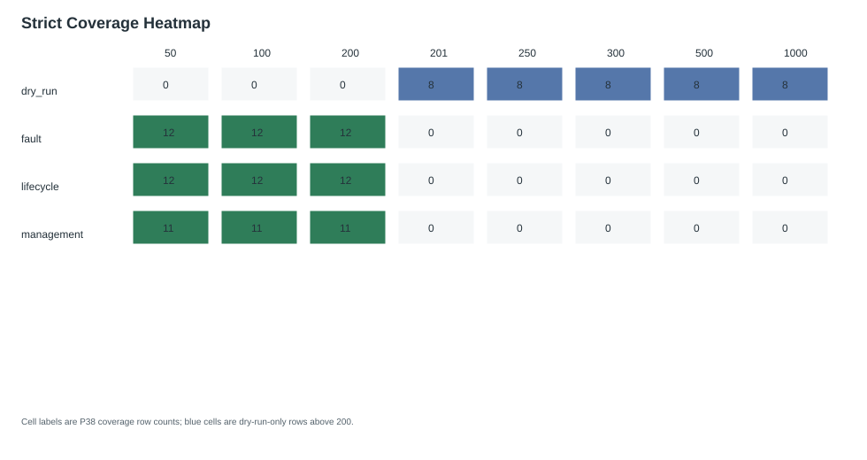
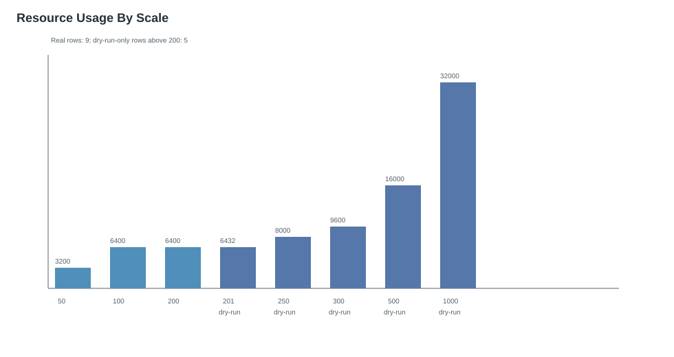
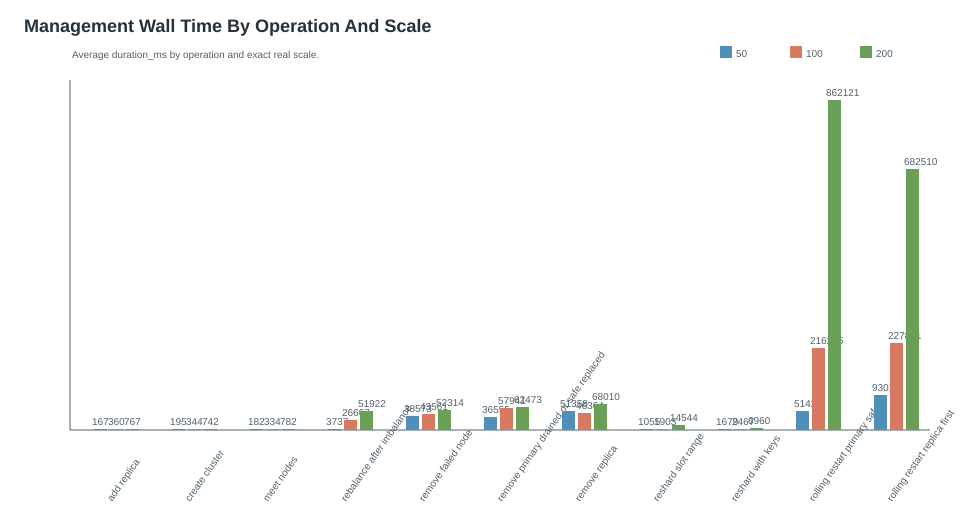
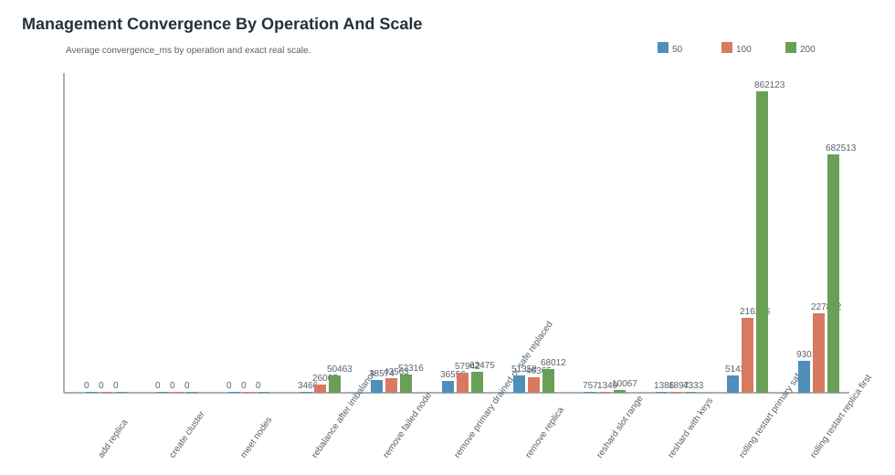
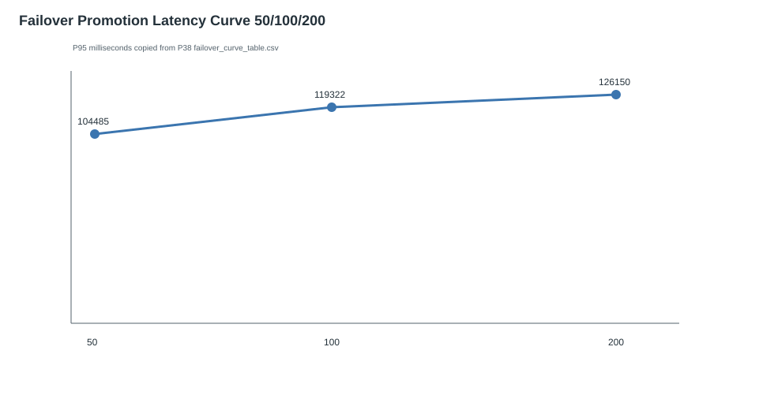
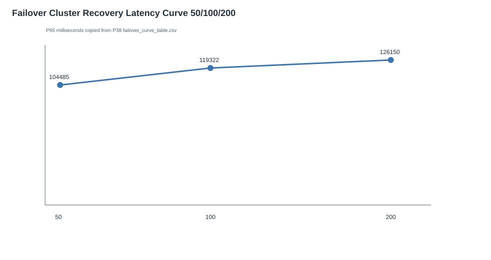
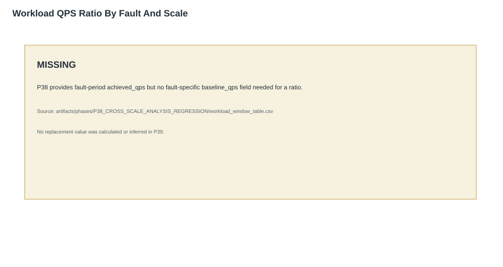
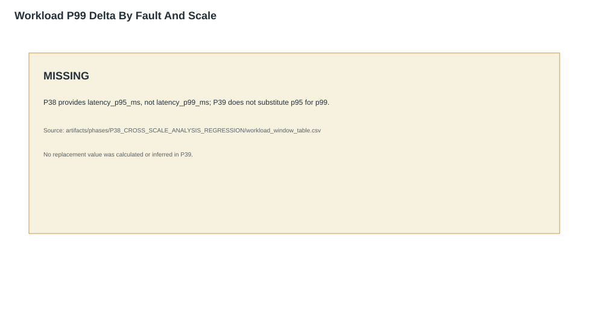
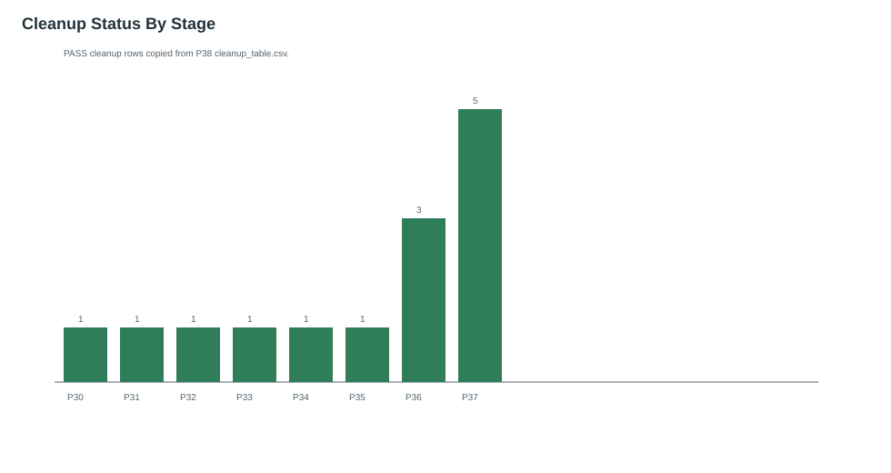

# P39 Visual Report Quality Gate

## Executive summary

P39 is report-only and renders deterministic Markdown, HTML, and SVG views from P38 analysis outputs. It copied 145 coverage rows, 33 management latency rows, 6 failover curve rows, 42 fault-impact rows, and 1687 missing-data rows. It started no runtime and created no new Valkey evidence.

Sources: `artifacts/phases/P38_CROSS_SCALE_ANALYSIS_REGRESSION/cross_scale_analysis_summary.json`

## Strict coverage heatmap

| Category | Rows |
| --- | --- |
| dry_run | 40 |
| fault | 36 |
| lifecycle | 36 |
| management | 33 |

Sources: `artifacts/phases/P38_CROSS_SCALE_ANALYSIS_REGRESSION/coverage_heatmap_table.csv`

## Resource preflight and scale feasibility

| Scale | Category | Mode | Nodes | Required memory MB | Projected node memory MB | Source |
| --- | --- | --- | --- | --- | --- | --- |
| 50 | fault | real | 50 | 3200 | SKIPPED_WITH_REASON | artifacts/phases/P33_FAULT_FAILOVER_MATRIX_50_REAL/resource_preflight.json |
| 50 | lifecycle | real | 50 | 3200 | SKIPPED_WITH_REASON | artifacts/phases/P36_FULL_FLOW_E2E_50_100_200_REAL/full_flow_50/resource_preflight.json |
| 50 | management | real | 50 | 3200 | SKIPPED_WITH_REASON | artifacts/phases/P30_MANAGEMENT_MATRIX_50_REAL/resource_preflight.json |
| 100 | fault | real | 100 | 6400 | SKIPPED_WITH_REASON | artifacts/phases/P34_FAULT_FAILOVER_MATRIX_100_REAL/resource_preflight.json |
| 100 | lifecycle | real | 100 | 6400 | SKIPPED_WITH_REASON | artifacts/phases/P36_FULL_FLOW_E2E_50_100_200_REAL/full_flow_100/resource_preflight.json |
| 100 | management | real | 100 | 6400 | SKIPPED_WITH_REASON | artifacts/phases/P31_MANAGEMENT_MATRIX_100_REAL/resource_preflight.json |
| 200 | fault | real | 200 | 6400 | SKIPPED_WITH_REASON | artifacts/phases/P35_FAULT_FAILOVER_MATRIX_200_REAL/resource_preflight.json |
| 200 | lifecycle | real | 200 | 6400 | SKIPPED_WITH_REASON | artifacts/phases/P36_FULL_FLOW_E2E_50_100_200_REAL/full_flow_200/resource_preflight.json |
| 200 | management | real | 200 | 6400 | SKIPPED_WITH_REASON | artifacts/phases/P32_MANAGEMENT_MATRIX_200_REAL/resource_preflight.json |
| 201 | dry_run | dry_run | 201 | SKIPPED_WITH_REASON | 6432 | artifacts/phases/P37_200_PLUS_DRY_RUN_SUPPORT/resource_estimate_201.json |
| 250 | dry_run | dry_run | 250 | SKIPPED_WITH_REASON | 8000 | artifacts/phases/P37_200_PLUS_DRY_RUN_SUPPORT/resource_estimate_250.json |
| 300 | dry_run | dry_run | 300 | SKIPPED_WITH_REASON | 9600 | artifacts/phases/P37_200_PLUS_DRY_RUN_SUPPORT/resource_estimate_300.json |
| 500 | dry_run | dry_run | 500 | SKIPPED_WITH_REASON | 16000 | artifacts/phases/P37_200_PLUS_DRY_RUN_SUPPORT/resource_estimate_500.json |
| 1000 | dry_run | dry_run | 1000 | SKIPPED_WITH_REASON | 32000 | artifacts/phases/P37_200_PLUS_DRY_RUN_SUPPORT/resource_estimate_1000.json |

Sources: `artifacts/phases/P38_CROSS_SCALE_ANALYSIS_REGRESSION/resource_usage_table.csv`

## Cluster lifecycle summary

| Scale | Lifecycle rows | Mode | Status |
| --- | --- | --- | --- |
| 50 | 12 | real | PASS |
| 100 | 12 | real | PASS |
| 200 | 12 | real | PASS |

Sources: `artifacts/phases/P38_CROSS_SCALE_ANALYSIS_REGRESSION/coverage_heatmap_table.csv`

## Management operation matrix

| Scale | Operation | Status | Duration ms | Command ms | Source |
| --- | --- | --- | --- | --- | --- |
| 200 | rolling_restart_primary_safe | PASS | 862120.50775 | 863166.0755 | artifacts/phases/P32_MANAGEMENT_MATRIX_200_REAL/management_operation_results.jsonl |
| 200 | rolling_restart_replica_first | PASS | 682510.399125 | 683016.936542 | artifacts/phases/P32_MANAGEMENT_MATRIX_200_REAL/management_operation_results.jsonl |
| 100 | rolling_restart_replica_first | PASS | 227851.240375 | 228092.603083 | artifacts/phases/P31_MANAGEMENT_MATRIX_100_REAL/management_operation_results.jsonl |
| 100 | rolling_restart_primary_safe | PASS | 216235.07225 | 216455.216416 | artifacts/phases/P31_MANAGEMENT_MATRIX_100_REAL/management_operation_results.jsonl |
| 50 | rolling_restart_replica_first | PASS | 93018.311042 | 93125.8305 | artifacts/phases/P30_MANAGEMENT_MATRIX_50_REAL/management_operation_results.jsonl |
| 200 | remove_replica | PASS | 68009.642375 | 68520.032292 | artifacts/phases/P32_MANAGEMENT_MATRIX_200_REAL/management_operation_results.jsonl |
| 200 | remove_primary_drained_or_safe_replaced | PASS | 62472.679708 | 62981.736625 | artifacts/phases/P32_MANAGEMENT_MATRIX_200_REAL/management_operation_results.jsonl |
| 100 | remove_primary_drained_or_safe_replaced | PASS | 57940.794208 | 58177.197083 | artifacts/phases/P31_MANAGEMENT_MATRIX_100_REAL/management_operation_results.jsonl |

Sources: `artifacts/phases/P38_CROSS_SCALE_ANALYSIS_REGRESSION/management_latency_table.csv`

## Management latency and convergence charts

Sources: `artifacts/phases/P38_CROSS_SCALE_ANALYSIS_REGRESSION/management_convergence_table.csv`, `artifacts/phases/P38_CROSS_SCALE_ANALYSIS_REGRESSION/management_latency_table.csv`

## Fault/failover matrix

| Scale | Fault rows | Mode | Status |
| --- | --- | --- | --- |
| 50 | 12 | real | PASS |
| 100 | 12 | real | PASS |
| 200 | 12 | real | PASS |

Sources: `artifacts/phases/P38_CROSS_SCALE_ANALYSIS_REGRESSION/coverage_heatmap_table.csv`

## Failover latency curves for 50/100/200

| Metric | Scale | P95 ms | Delta from previous scale | Source |
| --- | --- | --- | --- | --- |
| cluster_recovery_latency_ms | 50 | 104485.0 | SKIPPED_WITH_REASON | artifacts/phases/P33_FAULT_FAILOVER_MATRIX_50_REAL/failover_latency_curve.json |
| cluster_recovery_latency_ms | 100 | 119322.0 | 14837.0 | artifacts/phases/P34_FAULT_FAILOVER_MATRIX_100_REAL/failover_latency_curve.json |
| cluster_recovery_latency_ms | 200 | 126150.0 | 6828.0 | artifacts/phases/P35_FAULT_FAILOVER_MATRIX_200_REAL/failover_latency_curve.json |
| promotion_latency_ms | 50 | 104485.0 | SKIPPED_WITH_REASON | artifacts/phases/P33_FAULT_FAILOVER_MATRIX_50_REAL/failover_latency_curve.json |
| promotion_latency_ms | 100 | 119322.0 | 14837.0 | artifacts/phases/P34_FAULT_FAILOVER_MATRIX_100_REAL/failover_latency_curve.json |
| promotion_latency_ms | 200 | 126150.0 | 6828.0 | artifacts/phases/P35_FAULT_FAILOVER_MATRIX_200_REAL/failover_latency_curve.json |

Sources: `artifacts/phases/P38_CROSS_SCALE_ANALYSIS_REGRESSION/failover_curve_table.csv`

## Fault-period workload impact

The three delta charts are explicit `MISSING` displays with reasons because P38 does not include fault-specific baseline fields or latency_p99_ms. P39 does not substitute p95 or event-only values.

| Scale | Fault | Availability % | Errors | P95 ms | Source |
| --- | --- | --- | --- | --- | --- |
| 50 | az_stop | 100.0 | 0 | 2.99 | artifacts/phases/P33_FAULT_FAILOVER_MATRIX_50_REAL/fault_workload_impact.json |
| 50 | fault_period_workload_impact | 100.0 | 0 | 3.68 | artifacts/phases/P33_FAULT_FAILOVER_MATRIX_50_REAL/fault_workload_impact.json |
| 50 | majority_partition | 0.0 | 12 | 0.0 | artifacts/phases/P33_FAULT_FAILOVER_MATRIX_50_REAL/fault_workload_impact.json |
| 50 | minority_partition | 0.0 | 12 | 0.0 | artifacts/phases/P33_FAULT_FAILOVER_MATRIX_50_REAL/fault_workload_impact.json |
| 50 | network_delay | 100.0 | 0 | 164.217 | artifacts/phases/P33_FAULT_FAILOVER_MATRIX_50_REAL/fault_workload_impact.json |
| 50 | network_flap | 50.0 | 6 | 4.475 | artifacts/phases/P33_FAULT_FAILOVER_MATRIX_50_REAL/fault_workload_impact.json |
| 50 | network_loss | 50.0 | 6 | 4.498 | artifacts/phases/P33_FAULT_FAILOVER_MATRIX_50_REAL/fault_workload_impact.json |
| 50 | network_partition | 0.0 | 12 | 0.0 | artifacts/phases/P33_FAULT_FAILOVER_MATRIX_50_REAL/fault_workload_impact.json |
| 50 | node_host_stop | 12.5 | 7 | 2.797 | artifacts/phases/P33_FAULT_FAILOVER_MATRIX_50_REAL/fault_workload_impact.json |
| 50 | primary_stop_failover | 100.0 | 0 | 2.326 | artifacts/phases/P33_FAULT_FAILOVER_MATRIX_50_REAL/fault_workload_impact.json |
| 50 | primary_stop_failover | 100.0 | 0 | 2.508 | artifacts/phases/P33_FAULT_FAILOVER_MATRIX_50_REAL/fault_workload_impact.json |
| 50 | primary_stop_failover | 100.0 | 0 | 2.382 | artifacts/phases/P33_FAULT_FAILOVER_MATRIX_50_REAL/fault_workload_impact.json |
| 50 | replica_stop | 0.0 | 8 | 0.0 | artifacts/phases/P33_FAULT_FAILOVER_MATRIX_50_REAL/fault_workload_impact.json |
| 50 | split_brain_window_detection | 100.0 | 0 | 5.429 | artifacts/phases/P33_FAULT_FAILOVER_MATRIX_50_REAL/fault_workload_impact.json |
| 100 | az_stop | 100.0 | 0 | 2.809 | artifacts/phases/P34_FAULT_FAILOVER_MATRIX_100_REAL/fault_workload_impact.json |
| 100 | fault_period_workload_impact | 100.0 | 0 | 7.809 | artifacts/phases/P34_FAULT_FAILOVER_MATRIX_100_REAL/fault_workload_impact.json |
| 100 | majority_partition | 0.0 | 12 | 0.0 | artifacts/phases/P34_FAULT_FAILOVER_MATRIX_100_REAL/fault_workload_impact.json |
| 100 | minority_partition | 0.0 | 12 | 0.0 | artifacts/phases/P34_FAULT_FAILOVER_MATRIX_100_REAL/fault_workload_impact.json |

Sources: `artifacts/phases/P38_CROSS_SCALE_ANALYSIS_REGRESSION/fault_impact_table.csv`, `artifacts/phases/P38_CROSS_SCALE_ANALYSIS_REGRESSION/workload_window_table.csv`

## Partition and split-brain findings

| Scale | Fault | Availability % | Errors | Source |
| --- | --- | --- | --- | --- |
| 50 | majority_partition | 0.0 | 12 | artifacts/phases/P33_FAULT_FAILOVER_MATRIX_50_REAL/fault_workload_impact.json |
| 50 | minority_partition | 0.0 | 12 | artifacts/phases/P33_FAULT_FAILOVER_MATRIX_50_REAL/fault_workload_impact.json |
| 50 | network_partition | 0.0 | 12 | artifacts/phases/P33_FAULT_FAILOVER_MATRIX_50_REAL/fault_workload_impact.json |
| 50 | split_brain_window_detection | 100.0 | 0 | artifacts/phases/P33_FAULT_FAILOVER_MATRIX_50_REAL/fault_workload_impact.json |
| 100 | majority_partition | 0.0 | 12 | artifacts/phases/P34_FAULT_FAILOVER_MATRIX_100_REAL/fault_workload_impact.json |
| 100 | minority_partition | 0.0 | 12 | artifacts/phases/P34_FAULT_FAILOVER_MATRIX_100_REAL/fault_workload_impact.json |
| 100 | network_partition | 0.0 | 12 | artifacts/phases/P34_FAULT_FAILOVER_MATRIX_100_REAL/fault_workload_impact.json |
| 100 | split_brain_window_detection | 100.0 | 0 | artifacts/phases/P34_FAULT_FAILOVER_MATRIX_100_REAL/fault_workload_impact.json |
| 200 | majority_partition | 0.0 | 12 | artifacts/phases/P35_FAULT_FAILOVER_MATRIX_200_REAL/fault_workload_impact.json |
| 200 | minority_partition | 0.0 | 12 | artifacts/phases/P35_FAULT_FAILOVER_MATRIX_200_REAL/fault_workload_impact.json |
| 200 | network_partition | 0.0 | 12 | artifacts/phases/P35_FAULT_FAILOVER_MATRIX_200_REAL/fault_workload_impact.json |
| 200 | split_brain_window_detection | 100.0 | 0 | artifacts/phases/P35_FAULT_FAILOVER_MATRIX_200_REAL/fault_workload_impact.json |

Sources: `artifacts/phases/P38_CROSS_SCALE_ANALYSIS_REGRESSION/fault_impact_table.csv`

## Telemetry completeness

| Table | Rows |
| --- | --- |
| coverage_heatmap_table.csv | 145 |
| management_latency_table.csv | 33 |
| management_convergence_table.csv | 33 |
| failover_curve_table.csv | 6 |
| fault_impact_table.csv | 42 |
| workload_window_table.csv | 279 |
| resource_usage_table.csv | 14 |
| cleanup_table.csv | 14 |
| missing_data_table.csv | 1687 |

Sources: `artifacts/phases/P38_CROSS_SCALE_ANALYSIS_REGRESSION/quant_summary.json`

## Cleanup and leftover-resource summary

| Scale | Category | Mode | Cleanup status | Runtime resources | Source |
| --- | --- | --- | --- | --- | --- |
| 50 | fault | real | PASS | false_after_cleanup | artifacts/phases/P33_FAULT_FAILOVER_MATRIX_50_REAL/cleanup_report.json |
| 50 | lifecycle | real | PASS | false_after_cleanup | artifacts/phases/P36_FULL_FLOW_E2E_50_100_200_REAL/full_flow_50/cleanup_report.json |
| 50 | management | real | PASS | false_after_cleanup | artifacts/phases/P30_MANAGEMENT_MATRIX_50_REAL/cleanup_report.json |
| 100 | fault | real | PASS | false_after_cleanup | artifacts/phases/P34_FAULT_FAILOVER_MATRIX_100_REAL/cleanup_report.json |
| 100 | lifecycle | real | PASS | false_after_cleanup | artifacts/phases/P36_FULL_FLOW_E2E_50_100_200_REAL/full_flow_100/cleanup_report.json |
| 100 | management | real | PASS | false_after_cleanup | artifacts/phases/P31_MANAGEMENT_MATRIX_100_REAL/cleanup_report.json |
| 200 | fault | real | PASS | false_after_cleanup | artifacts/phases/P35_FAULT_FAILOVER_MATRIX_200_REAL/cleanup_report.json |
| 200 | lifecycle | real | PASS | false_after_cleanup | artifacts/phases/P36_FULL_FLOW_E2E_50_100_200_REAL/full_flow_200/cleanup_report.json |
| 200 | management | real | PASS | false_after_cleanup | artifacts/phases/P32_MANAGEMENT_MATRIX_200_REAL/cleanup_report.json |
| 201 | dry_run | dry_run | PASS | False | artifacts/phases/P37_200_PLUS_DRY_RUN_SUPPORT/no_runtime_created_proof_201.json |
| 250 | dry_run | dry_run | PASS | False | artifacts/phases/P37_200_PLUS_DRY_RUN_SUPPORT/no_runtime_created_proof_250.json |
| 300 | dry_run | dry_run | PASS | False | artifacts/phases/P37_200_PLUS_DRY_RUN_SUPPORT/no_runtime_created_proof_300.json |
| 500 | dry_run | dry_run | PASS | False | artifacts/phases/P37_200_PLUS_DRY_RUN_SUPPORT/no_runtime_created_proof_500.json |
| 1000 | dry_run | dry_run | PASS | False | artifacts/phases/P37_200_PLUS_DRY_RUN_SUPPORT/no_runtime_created_proof_1000.json |

Sources: `artifacts/phases/P38_CROSS_SCALE_ANALYSIS_REGRESSION/cleanup_table.csv`

## >200 dry-run support summary

Rows above 200 nodes remain clearly dry-run-only and have no runtime-resource creation claim.

| Coverage ID | Scale | Mode | Status | Reason |
| --- | --- | --- | --- | --- |
| 201.dry_run.artifact_schema_projection_dry_run | 201 | dry_run | DRY_RUN_PASS | P37 target 201 completed dry-run-only artifact_schema_projection_dry_run with no runtime resources created. |
| 201.dry_run.config_validate_dry_run | 201 | dry_run | DRY_RUN_PASS | P37 target 201 completed dry-run-only config_validate_dry_run with no runtime resources created. |
| 201.dry_run.no_runtime_created_proof | 201 | dry_run | DRY_RUN_PASS | P37 target 201 completed dry-run-only no_runtime_created_proof with no runtime resources created. |
| 201.dry_run.placement_schedule_dry_run | 201 | dry_run | DRY_RUN_PASS | P37 target 201 completed dry-run-only placement_schedule_dry_run with no runtime resources created. |
| 201.dry_run.plan_cluster_dry_run | 201 | dry_run | DRY_RUN_PASS | P37 target 201 completed dry-run-only plan_cluster_dry_run with no runtime resources created. |
| 201.dry_run.port_directory_collision_check_dry_run | 201 | dry_run | DRY_RUN_PASS | P37 target 201 completed dry-run-only port_directory_collision_check_dry_run with no runtime resources created. |
| 201.dry_run.report_projection_dry_run | 201 | dry_run | DRY_RUN_PASS | P37 target 201 completed dry-run-only report_projection_dry_run with no runtime resources created. |
| 201.dry_run.resource_preflight_dry_run | 201 | dry_run | DRY_RUN_PASS | P37 target 201 completed dry-run-only resource_preflight_dry_run with no runtime resources created. |
| 250.dry_run.artifact_schema_projection_dry_run | 250 | dry_run | DRY_RUN_PASS | P37 target 250 completed dry-run-only artifact_schema_projection_dry_run with no runtime resources created. |
| 250.dry_run.config_validate_dry_run | 250 | dry_run | DRY_RUN_PASS | P37 target 250 completed dry-run-only config_validate_dry_run with no runtime resources created. |
| 250.dry_run.no_runtime_created_proof | 250 | dry_run | DRY_RUN_PASS | P37 target 250 completed dry-run-only no_runtime_created_proof with no runtime resources created. |
| 250.dry_run.placement_schedule_dry_run | 250 | dry_run | DRY_RUN_PASS | P37 target 250 completed dry-run-only placement_schedule_dry_run with no runtime resources created. |
| 250.dry_run.plan_cluster_dry_run | 250 | dry_run | DRY_RUN_PASS | P37 target 250 completed dry-run-only plan_cluster_dry_run with no runtime resources created. |
| 250.dry_run.port_directory_collision_check_dry_run | 250 | dry_run | DRY_RUN_PASS | P37 target 250 completed dry-run-only port_directory_collision_check_dry_run with no runtime resources created. |
| 250.dry_run.report_projection_dry_run | 250 | dry_run | DRY_RUN_PASS | P37 target 250 completed dry-run-only report_projection_dry_run with no runtime resources created. |
| 250.dry_run.resource_preflight_dry_run | 250 | dry_run | DRY_RUN_PASS | P37 target 250 completed dry-run-only resource_preflight_dry_run with no runtime resources created. |
| 300.dry_run.artifact_schema_projection_dry_run | 300 | dry_run | DRY_RUN_PASS | P37 target 300 completed dry-run-only artifact_schema_projection_dry_run with no runtime resources created. |
| 300.dry_run.config_validate_dry_run | 300 | dry_run | DRY_RUN_PASS | P37 target 300 completed dry-run-only config_validate_dry_run with no runtime resources created. |
| 300.dry_run.no_runtime_created_proof | 300 | dry_run | DRY_RUN_PASS | P37 target 300 completed dry-run-only no_runtime_created_proof with no runtime resources created. |
| 300.dry_run.placement_schedule_dry_run | 300 | dry_run | DRY_RUN_PASS | P37 target 300 completed dry-run-only placement_schedule_dry_run with no runtime resources created. |

Sources: `artifacts/phases/P38_CROSS_SCALE_ANALYSIS_REGRESSION/coverage_heatmap_table.csv`

## Missing-data and blocked-row appendix

| Coverage ID | Field | Status | Reason | Source |
| --- | --- | --- | --- | --- |
| 50.management.add_replica | $.bytes_migrated | MISSING | Valkey command path did not expose migrated byte counts for this operation. | artifacts/phases/P30_MANAGEMENT_MATRIX_50_REAL/management_operation_results.jsonl |
| 50.management.add_replica | $.missing_fields[0] | MISSING | add_replica timing is captured in runtime_timing_breakdown and cluster setup operations before matrix row emission. | artifacts/phases/P30_MANAGEMENT_MATRIX_50_REAL/management_operation_results.jsonl |
| 50.management.add_replica | command_ms | MISSING | add_replica timing is captured in runtime_timing_breakdown and cluster setup operations before matrix row emission. | artifacts/phases/P30_MANAGEMENT_MATRIX_50_REAL/management_operation_results.jsonl |
| 50.management.cleanup_verify | $.cleanup_actions[0] | SKIPPED_WITH_REASON | Valkey process was already stopped before cleanup termination. | artifacts/phases/P30_MANAGEMENT_MATRIX_50_REAL/cleanup_report.json |
| 50.management.cleanup_verify | $.cleanup_actions[10] | SKIPPED_WITH_REASON | Valkey process was already stopped before cleanup termination. | artifacts/phases/P30_MANAGEMENT_MATRIX_50_REAL/cleanup_report.json |
| 50.management.cleanup_verify | $.cleanup_actions[11] | SKIPPED_WITH_REASON | Valkey process was already stopped before cleanup termination. | artifacts/phases/P30_MANAGEMENT_MATRIX_50_REAL/cleanup_report.json |
| 50.management.cleanup_verify | $.cleanup_actions[12] | SKIPPED_WITH_REASON | Valkey process was already stopped before cleanup termination. | artifacts/phases/P30_MANAGEMENT_MATRIX_50_REAL/cleanup_report.json |
| 50.management.cleanup_verify | $.cleanup_actions[13] | SKIPPED_WITH_REASON | Valkey process was already stopped before cleanup termination. | artifacts/phases/P30_MANAGEMENT_MATRIX_50_REAL/cleanup_report.json |
| 50.management.cleanup_verify | $.cleanup_actions[14] | SKIPPED_WITH_REASON | Valkey process was already stopped before cleanup termination. | artifacts/phases/P30_MANAGEMENT_MATRIX_50_REAL/cleanup_report.json |
| 50.management.cleanup_verify | $.cleanup_actions[15] | SKIPPED_WITH_REASON | Valkey process was already stopped before cleanup termination. | artifacts/phases/P30_MANAGEMENT_MATRIX_50_REAL/cleanup_report.json |
| 50.management.cleanup_verify | $.cleanup_actions[16] | SKIPPED_WITH_REASON | Valkey process was already stopped before cleanup termination. | artifacts/phases/P30_MANAGEMENT_MATRIX_50_REAL/cleanup_report.json |
| 50.management.cleanup_verify | $.cleanup_actions[17] | SKIPPED_WITH_REASON | Valkey process was already stopped before cleanup termination. | artifacts/phases/P30_MANAGEMENT_MATRIX_50_REAL/cleanup_report.json |
| 50.management.cleanup_verify | $.cleanup_actions[18] | SKIPPED_WITH_REASON | Valkey process was already stopped before cleanup termination. | artifacts/phases/P30_MANAGEMENT_MATRIX_50_REAL/cleanup_report.json |
| 50.management.cleanup_verify | $.cleanup_actions[19] | SKIPPED_WITH_REASON | Valkey process was already stopped before cleanup termination. | artifacts/phases/P30_MANAGEMENT_MATRIX_50_REAL/cleanup_report.json |
| 50.management.cleanup_verify | $.cleanup_actions[1] | SKIPPED_WITH_REASON | Valkey process was already stopped before cleanup termination. | artifacts/phases/P30_MANAGEMENT_MATRIX_50_REAL/cleanup_report.json |
| 50.management.cleanup_verify | $.cleanup_actions[20] | SKIPPED_WITH_REASON | Valkey process was already stopped before cleanup termination. | artifacts/phases/P30_MANAGEMENT_MATRIX_50_REAL/cleanup_report.json |
| 50.management.cleanup_verify | $.cleanup_actions[21] | SKIPPED_WITH_REASON | Valkey process was already stopped before cleanup termination. | artifacts/phases/P30_MANAGEMENT_MATRIX_50_REAL/cleanup_report.json |
| 50.management.cleanup_verify | $.cleanup_actions[22] | SKIPPED_WITH_REASON | Valkey process was already stopped before cleanup termination. | artifacts/phases/P30_MANAGEMENT_MATRIX_50_REAL/cleanup_report.json |
| 50.management.cleanup_verify | $.cleanup_actions[23] | SKIPPED_WITH_REASON | Valkey process was already stopped before cleanup termination. | artifacts/phases/P30_MANAGEMENT_MATRIX_50_REAL/cleanup_report.json |
| 50.management.cleanup_verify | $.cleanup_actions[24] | SKIPPED_WITH_REASON | Valkey process was already stopped before cleanup termination. | artifacts/phases/P30_MANAGEMENT_MATRIX_50_REAL/cleanup_report.json |
| 50.management.cleanup_verify | $.cleanup_actions[25] | SKIPPED_WITH_REASON | Valkey process was already stopped before cleanup termination. | artifacts/phases/P30_MANAGEMENT_MATRIX_50_REAL/cleanup_report.json |
| 50.management.cleanup_verify | $.cleanup_actions[26] | SKIPPED_WITH_REASON | Valkey process was already stopped before cleanup termination. | artifacts/phases/P30_MANAGEMENT_MATRIX_50_REAL/cleanup_report.json |
| 50.management.cleanup_verify | $.cleanup_actions[27] | SKIPPED_WITH_REASON | Valkey process was already stopped before cleanup termination. | artifacts/phases/P30_MANAGEMENT_MATRIX_50_REAL/cleanup_report.json |
| 50.management.cleanup_verify | $.cleanup_actions[28] | SKIPPED_WITH_REASON | Valkey process was already stopped before cleanup termination. | artifacts/phases/P30_MANAGEMENT_MATRIX_50_REAL/cleanup_report.json |
| 50.management.cleanup_verify | $.cleanup_actions[29] | SKIPPED_WITH_REASON | Valkey process was already stopped before cleanup termination. | artifacts/phases/P30_MANAGEMENT_MATRIX_50_REAL/cleanup_report.json |

Sources: `artifacts/phases/P38_CROSS_SCALE_ANALYSIS_REGRESSION/missing_data_table.csv`

## Source artifact provenance index

| Source artifact | SHA-256 |
| --- | --- |
| artifacts/phases/P38_CROSS_SCALE_ANALYSIS_REGRESSION/coverage_heatmap_table.csv | 92985692d67efdc5969f4753e8f66d3193a854dad90d462fb77ab791fa134ef6 |
| artifacts/phases/P38_CROSS_SCALE_ANALYSIS_REGRESSION/management_latency_table.csv | e905947fb7a216c1b6390090fc84d8e543ee25017260c0b3f92ef2df4cd75895 |
| artifacts/phases/P38_CROSS_SCALE_ANALYSIS_REGRESSION/management_convergence_table.csv | 6b3d99132ac4eaa3d24841d26c6c3588d2f0b8b056f1d410ca77ca486b79fc16 |
| artifacts/phases/P38_CROSS_SCALE_ANALYSIS_REGRESSION/failover_curve_table.csv | 2859e99080d6f31e066257a6df023ccbcafe3d5c64cd3736b0ebb318e65cbf48 |
| artifacts/phases/P38_CROSS_SCALE_ANALYSIS_REGRESSION/fault_impact_table.csv | 2baab4c06b54c3076595e9723c9ec455667c1aa644d48174ab4d44e628a8023e |
| artifacts/phases/P38_CROSS_SCALE_ANALYSIS_REGRESSION/workload_window_table.csv | 61fa086ae995e03905f5348d029437f0e0c8040c3c24efc91ad70b603ba61ba1 |
| artifacts/phases/P38_CROSS_SCALE_ANALYSIS_REGRESSION/resource_usage_table.csv | a5da43a6d11b3e43b26c7b0ca55f724603e0f934cd510602b96a58550c85c267 |
| artifacts/phases/P38_CROSS_SCALE_ANALYSIS_REGRESSION/cleanup_table.csv | 02661ebdc50332951e81df662a966aafaec6edaf970988294706a481edf71f56 |
| artifacts/phases/P38_CROSS_SCALE_ANALYSIS_REGRESSION/missing_data_table.csv | 2024c619875d8be5b5b4aac90a2f90b0a718e8eaccfba908976b9137272f771b |
| artifacts/phases/P38_CROSS_SCALE_ANALYSIS_REGRESSION/phase_summary.json | 9ac0bc466464737df198953c8d0f123a41b551457b703ac09f17dffd510293be |
| artifacts/phases/P38_CROSS_SCALE_ANALYSIS_REGRESSION/cross_scale_analysis_summary.json | f838c69781e931b86493e74bb08e25950c57685481cc427cb3eedd873b74df0e |
| artifacts/phases/P38_CROSS_SCALE_ANALYSIS_REGRESSION/analysis_provenance.json | 040106a81552d0d945e265f185508f4db6d12955c9c415c2bbd0ffc7026c527a |
| artifacts/phases/P38_CROSS_SCALE_ANALYSIS_REGRESSION/regression_baseline.json | e8ce4001a7ab929db685e8b426453b756fea5c42aa7a31b525c43a14c58e1ae5 |
| artifacts/phases/P38_CROSS_SCALE_ANALYSIS_REGRESSION/quant_summary.json | d991c7c060f297b4ddbd28a4215d74176f046beab961a8460713adbf4347faff |

Sources: `artifacts/phases/P38_CROSS_SCALE_ANALYSIS_REGRESSION/analysis_provenance.json`
