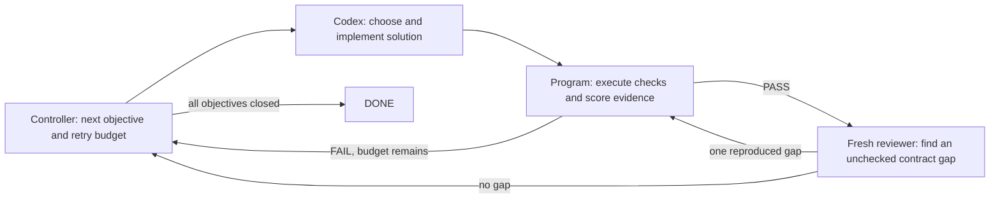

# Milestone 1 Meta Control Architecture

## Design Rule

The loop separates four decisions instead of asking one agent to police itself:

Codex is not forced through design, harness-red, implementation, verification,
admission, and audit phases. Those phases frequently duplicated work and made
the agent optimize the ceremony. A `WORK` item states the outcome, relevant
paths, last failing check, and attempts remaining. Codex owns the method.

## Controller

`codex/meta_m1/control_block.json` freezes six outcome objectives, dependencies,
program checks, validation levels, retry limits, and the 30..2000/50/200 scale
contract. `next` is idempotent while an item is active.

Each distinct failure fingerprint or Reviewer gap gets three implementation
attempts and one root-cause replan. A new gap receives a fresh budget; an
unchanged cached failure routes to replan early. Independent objectives may
proceed once their declared dependencies pass.

Progress is executable: highest validation level passed plus failing-check
count. Prose, changed line count, and agent confidence do not increase it.

## Program

`evaluate` runs level 0 through the objective's maximum level and stops at the
first failure. Unchanged input produces the cached result, including failures,
so repeating an expensive command cannot consume another run or masquerade as
progress. Full logs remain on disk; work items carry only a bounded excerpt.

Level 3 is exact 50-node real evidence. Level 4 is preflight-gated exact
200-node real evidence. The controller-owned wrapper invokes the product
interface `python3 -m valkey_scale_lab.cli milestone1 real-gate --scale <N>
--evidence-dir <PATH>`; Codex implements that outcome interface but does not
manually launch the large gate. The wrapper exports
`VSLAB_META_M1_CONTROLLER_OWNED=1` and the expected product digest. The
final objective reruns the non-real regression and admits both scales. The
exact-scale evaluator parses JSON/JSONL and rejects wrong node counts,
non-9.1.x versions, incomplete matrices, missing hashes, fixture-like paths,
failed cleanup, stale product digests, invented timing, unreferenced scenario
PASS claims, or missing independent probes.

## Reviewer

Review runs only after program PASS or repeated failure, not after every edit.
An acceptance reviewer has two valid outputs:

- `NO_GAP`: the objective closes.
- `GAP`: cite one exact frozen clause, explain one observable defect, and attach
  one level 0-2 program check that currently fails.

The controller executes that check before accepting the finding. A
`PRODUCT_GAP` becomes normal WORK. An `EVALUATOR_GAP` enters evaluator-only
repair; the immutable Kernel and product digest must remain unchanged. A
reviewer cannot enlarge the milestone, add a real-scale gate, or add multiple
findings per round. Each objective has at most two acceptance-review rounds.

## Why It Converges

- Six outcome objectives avoid dozens of tiny stages and repeated setup.
- A fixed goal prevents reviewer-driven scope growth.
- One active item prevents duplicate work.
- Cached failures route away from blind retries after one unchanged result.
- Improvement scoring and a single replan force an approach change.
- Real gates occur only after lower levels pass and only once per input digest.
- Reviewer findings become durable executable regressions, not recurring prose.
- Bounded review and retry budgets produce either measurable progress, DONE, or
  an honest BLOCKED result.
