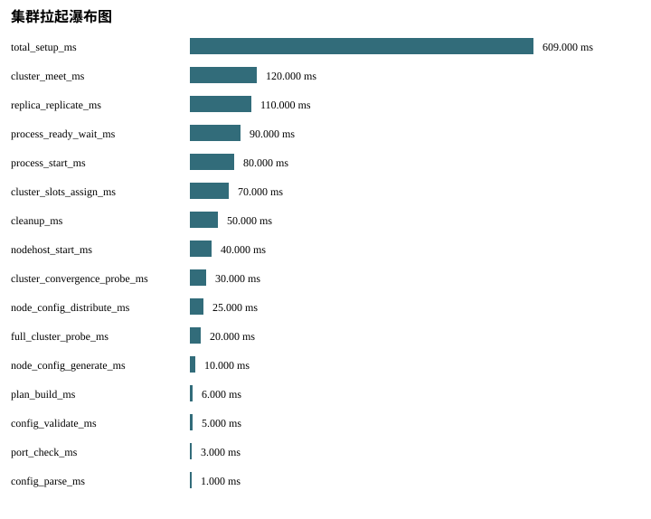

# P09 Analysis Report

Status: PASS
Source phase: M1-S02

## 运行元数据

- run_id: m1-s02-local
- created_at: 2026-07-08T14:06:06Z
- git_sha: 574271eaf8254d1f7e9180dfbd8c7b1ca9facd32
- valkey_version: MISSING: Valkey endpoints were not probed while creating run metadata.
- artifact_root: runs/m1-s02-local/artifacts

## 分析发现

- source_phase: PASS
- real_valkey_evidence: BLOCKED_WITH_REASON
- failover: SKIPPED_WITH_REASON
- cleanup: PASS
- setup_telemetry: PASS

## 集群拉起瀑布图

## 阶段耗时排序

- total_setup_ms: 609.0 ms
- cluster_meet_ms: 120.0 ms
- replica_replicate_ms: 110.0 ms
- process_ready_wait_ms: 90.0 ms
- process_start_ms: 80.0 ms
- cluster_slots_assign_ms: 70.0 ms
- cleanup_ms: 50.0 ms
- nodehost_start_ms: 40.0 ms
- cluster_convergence_probe_ms: 30.0 ms
- node_config_distribute_ms: 25.0 ms

## 慢节点 TopN

- shard-0000-replica-00: 90.0 ms, role=replica

## 缺失指标

- split_brain_duration_ms: SKIPPED_WITH_REASON - No failover scenario is executed in M1-S02.

## 生成表格

- metrics.csv
- missing_metrics.csv
- baseline_comparison.csv
- setup_phase_durations.csv
- setup_slowest_nodes.csv
- metric_chart.svg
- setup_waterfall.svg
