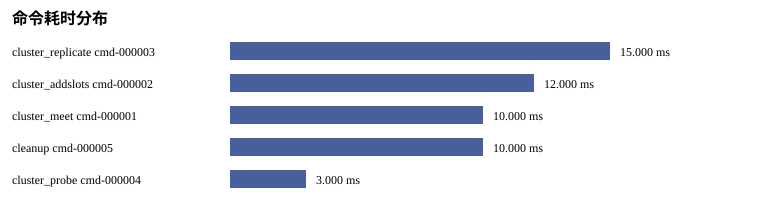

# P09 Analysis Report

Status: PASS
Source phase: M1-S03

## 运行元数据

- run_id: MISSING: run_id absent from run metadata
- created_at: MISSING: created_at absent from run metadata
- git_sha: MISSING: git_sha absent from run metadata
- valkey_version: MISSING: valkey_version absent from run metadata
- artifact_root: MISSING: artifact_root absent from run metadata

## 分析发现

- source_phase: PASS
- real_valkey_evidence: SKIPPED_WITH_REASON
- failover: SKIPPED_WITH_REASON
- cleanup: PASS
- setup_telemetry: SKIPPED_WITH_REASON
- command_audit: PASS

## 集群拉起瀑布图

- SKIPPED_WITH_REASON: setup_telemetry.json was not present in the input artifacts.

## 阶段耗时排序

- SKIPPED_WITH_REASON: 无可排序的阶段耗时

## 慢节点 TopN

- SKIPPED_WITH_REASON: 无慢节点样本

## 慢命令 TopN

- cmd-000003 cluster_replicate: 15 ms status=PASS
- cmd-000002 cluster_addslots: 12 ms status=PASS
- cmd-000001 cluster_meet: 10 ms status=PASS
- cmd-000005 cleanup: 10 ms status=PASS
- cmd-000004 cluster_probe: 3 ms status=PASS

## 失败命令

- none

## 重试命令

- none

## 命令审计覆盖

- total_commands: 5
- cleanup: 1
- cluster_addslots: 1
- cluster_meet: 1
- cluster_probe: 1
- cluster_replicate: 1

## 缺失指标

- split_brain_duration_ms: SKIPPED_WITH_REASON - M1-S03 covers command audit logging; failover measurement is handled in later milestone1 stages.

## 生成表格

- metrics.csv
- missing_metrics.csv
- baseline_comparison.csv
- setup_phase_durations.csv
- setup_slowest_nodes.csv
- command_slowest.csv
- command_failures.csv
- command_retries.csv
- metric_chart.svg
- setup_waterfall.svg
- command_latency.svg
