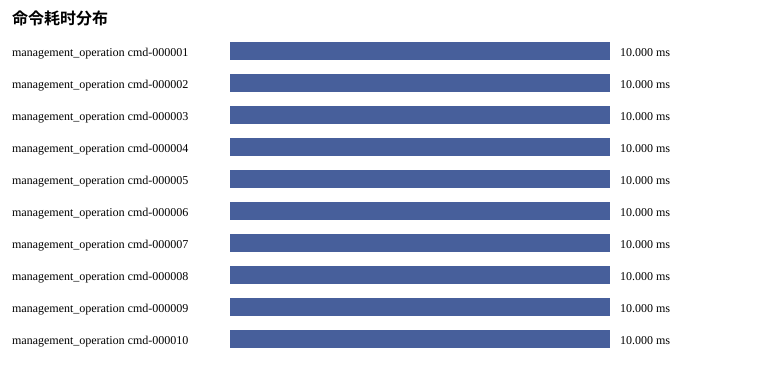
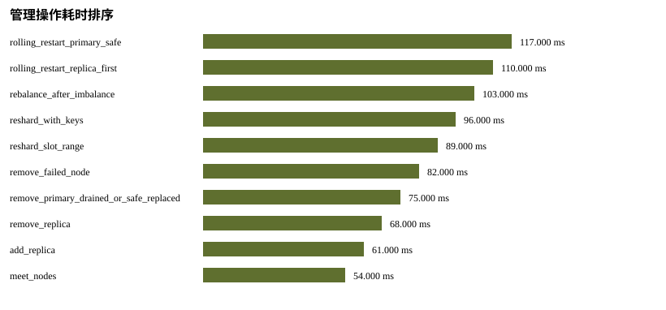
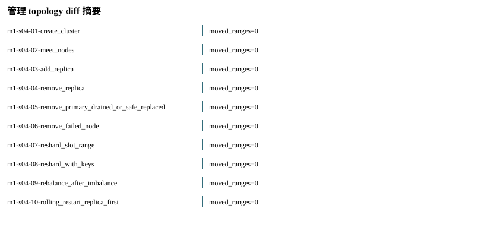

# P09 Analysis Report

Status: PASS
Source phase: M1-S04

## 运行元数据

- run_id: m1-s04-local
- created_at: 2026-07-08T15:07:19Z
- git_sha: bf111fe6b916ee21d92df1a44c310c54f8bf3fd1
- valkey_version: MISSING: Valkey endpoints were not probed while creating run metadata.
- artifact_root: runs/m1-s04-local/artifacts

## 分析发现

- source_phase: PASS
- real_valkey_evidence: BLOCKED_WITH_REASON
- failover: SKIPPED_WITH_REASON
- cleanup: PASS
- setup_telemetry: SKIPPED_WITH_REASON
- command_audit: PASS
- management_ops: PASS

## 集群拉起瀑布图

- SKIPPED_WITH_REASON: setup_telemetry.json was not present in the input artifacts.

## 阶段耗时排序

- SKIPPED_WITH_REASON: 无可排序的阶段耗时

## 慢节点 TopN

- SKIPPED_WITH_REASON: 无慢节点样本

## 慢命令 TopN

- cmd-000001 management_operation: 10.0 ms status=PASS
- cmd-000002 management_operation: 10.0 ms status=PASS
- cmd-000003 management_operation: 10.0 ms status=PASS
- cmd-000004 management_operation: 10.0 ms status=PASS
- cmd-000005 management_operation: 10.0 ms status=PASS
- cmd-000006 management_operation: 10.0 ms status=PASS
- cmd-000007 management_operation: 10.0 ms status=PASS
- cmd-000008 management_operation: 10.0 ms status=PASS
- cmd-000009 management_operation: 10.0 ms status=PASS
- cmd-000010 management_operation: 10.0 ms status=PASS

## 失败命令

- none

## 重试命令

- none

## 命令审计覆盖

- total_commands: 11
- management_operation: 11

## 管理操作矩阵

- rolling_restart_primary_safe: 117.0 ms status=PASS commands=1
- rolling_restart_replica_first: 110.0 ms status=PASS commands=1
- rebalance_after_imbalance: 103.0 ms status=PASS commands=1
- reshard_with_keys: 96.0 ms status=PASS commands=1
- reshard_slot_range: 89.0 ms status=PASS commands=1
- remove_failed_node: 82.0 ms status=PASS commands=1
- remove_primary_drained_or_safe_replaced: 75.0 ms status=PASS commands=1
- remove_replica: 68.0 ms status=PASS commands=1
- add_replica: 61.0 ms status=PASS commands=1
- meet_nodes: 54.0 ms status=PASS commands=1

## 管理 topology diff 摘要

- m1-s04-01-create_cluster: known_nodes_delta=0, moved_slot_ranges=0
- m1-s04-02-meet_nodes: known_nodes_delta=0, moved_slot_ranges=0
- m1-s04-03-add_replica: known_nodes_delta=0, moved_slot_ranges=0
- m1-s04-04-remove_replica: known_nodes_delta=0, moved_slot_ranges=0
- m1-s04-05-remove_primary_drained_or_safe_replaced: known_nodes_delta=0, moved_slot_ranges=0
- m1-s04-06-remove_failed_node: known_nodes_delta=0, moved_slot_ranges=0
- m1-s04-07-reshard_slot_range: known_nodes_delta=0, moved_slot_ranges=0
- m1-s04-08-reshard_with_keys: known_nodes_delta=0, moved_slot_ranges=0
- m1-s04-09-rebalance_after_imbalance: known_nodes_delta=0, moved_slot_ranges=0
- m1-s04-10-rolling_restart_replica_first: known_nodes_delta=0, moved_slot_ranges=0

## 缺失指标

- none

## 生成表格

- metrics.csv
- missing_metrics.csv
- baseline_comparison.csv
- setup_phase_durations.csv
- setup_slowest_nodes.csv
- command_slowest.csv
- command_failures.csv
- command_retries.csv
- management_ops_matrix.csv
- management_operation_durations.csv
- management_topology_diffs.csv
- management_rolling_restart.csv
- management_reshard_rebalance.csv
- metric_chart.svg
- setup_waterfall.svg
- command_latency.svg
- management_operation_duration.svg
- management_topology_diff.svg
