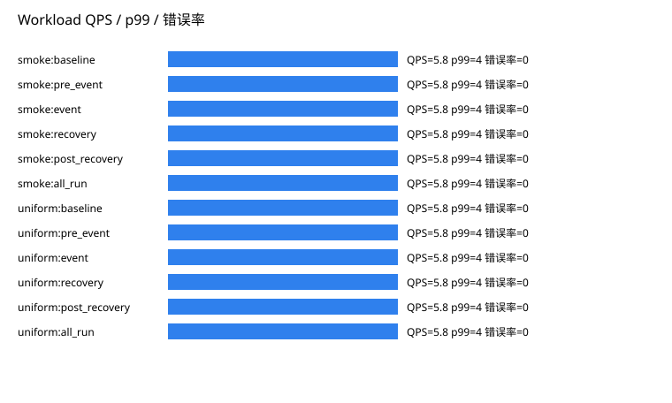

# P09 Analysis Report

Status: PASS
Source phase: M1-S05

## 运行元数据

- run_id: MISSING: run_id absent from run metadata
- created_at: MISSING: created_at absent from run metadata
- git_sha: MISSING: git_sha absent from run metadata
- valkey_version: MISSING: valkey_version absent from run metadata
- artifact_root: MISSING: artifact_root absent from run metadata

## 分析发现

- source_phase: PASS
- real_valkey_evidence: SKIPPED_WITH_REASON
- failover: SKIPPED_WITH_REASON
- cleanup: PASS
- setup_telemetry: SKIPPED_WITH_REASON
- command_audit: SKIPPED_WITH_REASON
- management_ops: SKIPPED_WITH_REASON
- workload_benchmark: PASS

## 集群拉起瀑布图

- SKIPPED_WITH_REASON: setup_telemetry.json was not present in the input artifacts.

## 阶段耗时排序

- SKIPPED_WITH_REASON: 无可排序的阶段耗时

## 慢节点 TopN

- SKIPPED_WITH_REASON: 无慢节点样本

## 慢命令 TopN

- SKIPPED_WITH_REASON: Input artifacts did not include command_log.jsonl.

## 失败命令

- none

## 重试命令

- none

## 命令审计覆盖

- total_commands: 0

## 管理操作矩阵

- SKIPPED_WITH_REASON: Input artifacts did not include management_ops_matrix.json or management_operation_results.jsonl.

## 管理 topology diff 摘要

- SKIPPED_WITH_REASON: 无 topology diff 样本

## Workload 基准压测

- 覆盖 profile: hotspot, mixed_rw, read_heavy, smoke, uniform, write_heavy
- 全 slot 覆盖: True。该值来自 workload_windows.json 的 hash_slot_coverage，用于确认基准压测不是只走固定 hash tag。
- smoke baseline: 实际 QPS=5.8，p99 延迟 ms=4，错误率=0
- smoke pre_event: 实际 QPS=5.8，p99 延迟 ms=4，错误率=0
- smoke event: 实际 QPS=5.8，p99 延迟 ms=4，错误率=0
- smoke recovery: 实际 QPS=5.8，p99 延迟 ms=4，错误率=0
- smoke post_recovery: 实际 QPS=5.8，p99 延迟 ms=4，错误率=0
- smoke all_run: 实际 QPS=5.8，p99 延迟 ms=4，错误率=0
- uniform baseline: 实际 QPS=5.8，p99 延迟 ms=4，错误率=0
- uniform pre_event: 实际 QPS=5.8，p99 延迟 ms=4，错误率=0
- uniform event: 实际 QPS=5.8，p99 延迟 ms=4，错误率=0
- uniform recovery: 实际 QPS=5.8，p99 延迟 ms=4，错误率=0
- uniform post_recovery: 实际 QPS=5.8，p99 延迟 ms=4，错误率=0
- uniform all_run: 实际 QPS=5.8，p99 延迟 ms=4，错误率=0

## 缺失指标

- command_log.total_commands: SKIPPED_WITH_REASON - Input artifacts did not include command_log.jsonl.
- management.operation_count: SKIPPED_WITH_REASON - Management operation artifacts were not present.

## 生成表格

- metrics.csv
- missing_metrics.csv
- baseline_comparison.csv
- setup_phase_durations.csv
- setup_slowest_nodes.csv
- command_slowest.csv
- command_failures.csv
- command_retries.csv
- management_ops_matrix.csv
- management_operation_durations.csv
- management_topology_diffs.csv
- management_rolling_restart.csv
- management_reshard_rebalance.csv
- workload_benchmark_windows.csv
- workload_profile_summary.csv
- metric_chart.svg
- setup_waterfall.svg
- command_latency.svg
- management_operation_duration.svg
- management_topology_diff.svg
- workload_qps_p99_error.svg
