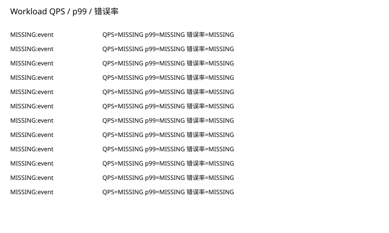
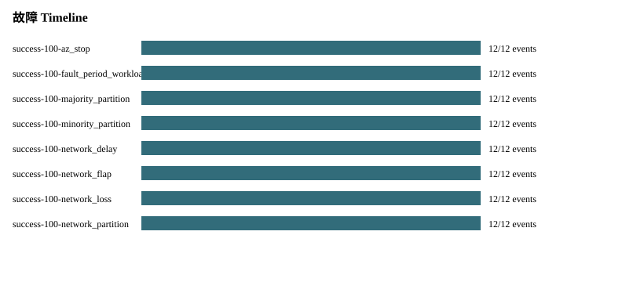
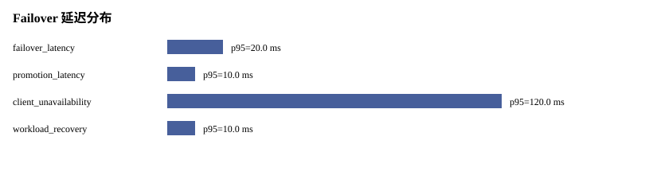
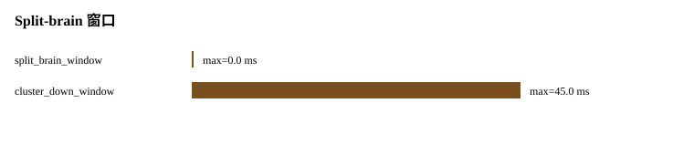
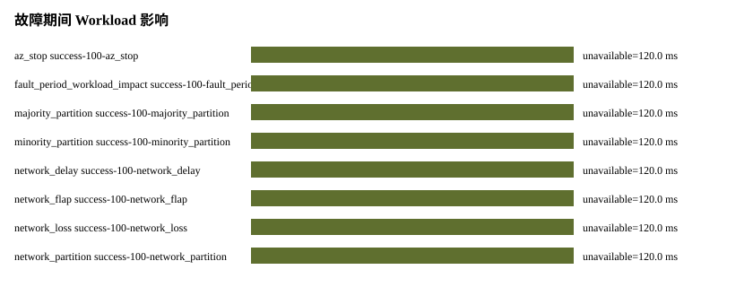

# P09 Analysis Report

Status: PASS
Source phase: M1-S06

## 运行元数据

- run_id: MISSING: run_id absent from run metadata
- created_at: MISSING: created_at absent from run metadata
- git_sha: MISSING: git_sha absent from run metadata
- valkey_version: MISSING: valkey_version absent from run metadata
- artifact_root: MISSING: artifact_root absent from run metadata

## 分析发现

- source_phase: PASS
- real_valkey_evidence: SKIPPED_WITH_REASON
- failover: SKIPPED_WITH_REASON
- cleanup: PASS
- setup_telemetry: SKIPPED_WITH_REASON
- command_audit: SKIPPED_WITH_REASON
- management_ops: SKIPPED_WITH_REASON
- workload_benchmark: PASS
- fault_timeline: PARTIAL

## 集群拉起瀑布图

- SKIPPED_WITH_REASON: setup_telemetry.json was not present in the input artifacts.

## 阶段耗时排序

- SKIPPED_WITH_REASON: 无可排序的阶段耗时

## 慢节点 TopN

- SKIPPED_WITH_REASON: 无慢节点样本

## 慢命令 TopN

- SKIPPED_WITH_REASON: Input artifacts did not include command_log.jsonl.

## 失败命令

- none

## 重试命令

- none

## 命令审计覆盖

- total_commands: 0

## 管理操作矩阵

- SKIPPED_WITH_REASON: Input artifacts did not include management_ops_matrix.json or management_operation_results.jsonl.

## 管理 topology diff 摘要

- SKIPPED_WITH_REASON: 无 topology diff 样本

## Workload 基准压测

- 覆盖 profile: 
- 全 slot 覆盖: False。该值来自 workload_windows.json 的 hash_slot_coverage，用于确认基准压测不是只走固定 hash tag。
- MISSING event: 实际 QPS=MISSING，p99 延迟 ms=MISSING，错误率=MISSING
- MISSING event: 实际 QPS=MISSING，p99 延迟 ms=MISSING，错误率=MISSING
- MISSING event: 实际 QPS=MISSING，p99 延迟 ms=MISSING，错误率=MISSING
- MISSING event: 实际 QPS=MISSING，p99 延迟 ms=MISSING，错误率=MISSING
- MISSING event: 实际 QPS=MISSING，p99 延迟 ms=MISSING，错误率=MISSING
- MISSING event: 实际 QPS=MISSING，p99 延迟 ms=MISSING，错误率=MISSING
- MISSING event: 实际 QPS=MISSING，p99 延迟 ms=MISSING，错误率=MISSING
- MISSING event: 实际 QPS=MISSING，p99 延迟 ms=MISSING，错误率=MISSING
- MISSING event: 实际 QPS=MISSING，p99 延迟 ms=MISSING，错误率=MISSING
- MISSING event: 实际 QPS=MISSING，p99 延迟 ms=MISSING，错误率=MISSING
- MISSING event: 实际 QPS=MISSING，p99 延迟 ms=MISSING，错误率=MISSING
- MISSING event: 实际 QPS=MISSING，p99 延迟 ms=MISSING，错误率=MISSING

## 故障 Timeline

- success-100-az_stop: observed=12/12, missing=none
- success-100-fault_period_workload_impact: observed=12/12, missing=none
- success-100-majority_partition: observed=12/12, missing=none
- success-100-minority_partition: observed=12/12, missing=none
- success-100-network_delay: observed=12/12, missing=none
- success-100-network_flap: observed=12/12, missing=none
- success-100-network_loss: observed=12/12, missing=none
- success-100-network_partition: observed=12/12, missing=none
- success-100-node_host_stop: observed=12/12, missing=none
- success-100-primary_stop_failover: observed=12/12, missing=none

## Failover 延迟分布

- failover_latency: p50=20.0 ms, p95=20.0 ms, max=20.0 ms, status=PASS
- promotion_latency: p50=10.0 ms, p95=10.0 ms, max=10.0 ms, status=PASS
- client_unavailability: p50=120.0 ms, p95=120.0 ms, max=120.0 ms, status=PASS
- workload_recovery: p50=10.0 ms, p95=10.0 ms, max=10.0 ms, status=PASS

## Split-brain 窗口

- split_brain_window: p95=0.0 ms, max=0.0 ms, status=PASS
- cluster_down_window: p95=45.0 ms, max=45.0 ms, status=PASS

## 故障期间 Workload 影响

- az_stop success-100-az_stop: client_unavailability_ms=120.0, workload_recovery_ms=10.0, status=PARTIAL
- fault_period_workload_impact success-100-fault_period_workload_impact: client_unavailability_ms=120.0, workload_recovery_ms=10.0, status=PARTIAL
- majority_partition success-100-majority_partition: client_unavailability_ms=120.0, workload_recovery_ms=10.0, status=PASS
- minority_partition success-100-minority_partition: client_unavailability_ms=120.0, workload_recovery_ms=10.0, status=PASS
- network_delay success-100-network_delay: client_unavailability_ms=120.0, workload_recovery_ms=10.0, status=PARTIAL
- network_flap success-100-network_flap: client_unavailability_ms=120.0, workload_recovery_ms=10.0, status=PARTIAL
- network_loss success-100-network_loss: client_unavailability_ms=120.0, workload_recovery_ms=10.0, status=PARTIAL
- network_partition success-100-network_partition: client_unavailability_ms=120.0, workload_recovery_ms=10.0, status=PARTIAL
- node_host_stop success-100-node_host_stop: client_unavailability_ms=120.0, workload_recovery_ms=10.0, status=PARTIAL
- primary_stop_failover success-100-primary_stop_failover: client_unavailability_ms=120.0, workload_recovery_ms=10.0, status=PASS

## 缺失指标

- command_log.total_commands: SKIPPED_WITH_REASON - Input artifacts did not include command_log.jsonl.
- fault_timeline.promotion_latency_ms: MISSING - promotion_latency_ms cannot be derived because promotion_observed=SKIPPED_WITH_REASON: promotion_expected=false for this fault type
- management.operation_count: SKIPPED_WITH_REASON - Management operation artifacts were not present.
- promotion_latency_ms: MISSING - promotion_latency_ms cannot be derived because promotion_observed=SKIPPED_WITH_REASON: promotion_expected=false for this fault type

## 生成表格

- metrics.csv
- missing_metrics.csv
- baseline_comparison.csv
- setup_phase_durations.csv
- setup_slowest_nodes.csv
- command_slowest.csv
- command_failures.csv
- command_retries.csv
- management_ops_matrix.csv
- management_operation_durations.csv
- management_topology_diffs.csv
- management_rolling_restart.csv
- management_reshard_rebalance.csv
- workload_benchmark_windows.csv
- workload_profile_summary.csv
- fault_timeline_events.csv
- fault_timeline_summary.csv
- failover_latency_distribution.csv
- split_brain_windows.csv
- fault_workload_impact.csv
- metric_chart.svg
- setup_waterfall.svg
- command_latency.svg
- management_operation_duration.svg
- management_topology_diff.svg
- workload_qps_p99_error.svg
- fault_timeline.svg
- failover_latency_distribution.svg
- split_brain_window.svg
- fault_workload_impact.svg
