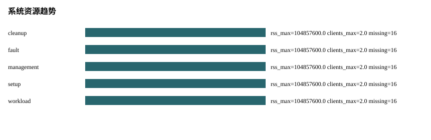

# P09 Analysis Report

Status: PASS
Source phase: P09_ANALYSIS_REPORTING

## 运行元数据

- run_id: MISSING: run_id absent from run metadata
- created_at: MISSING: created_at absent from run metadata
- git_sha: MISSING: git_sha absent from run metadata
- valkey_version: MISSING: valkey_version absent from run metadata
- artifact_root: MISSING: artifact_root absent from run metadata

## 分析发现

- source_phase: PASS
- real_valkey_evidence: PASS
- failover: SKIPPED_WITH_REASON
- cleanup: PASS
- setup_telemetry: SKIPPED_WITH_REASON
- command_audit: SKIPPED_WITH_REASON
- management_ops: SKIPPED_WITH_REASON
- workload_benchmark: SKIPPED_WITH_REASON
- fault_timeline: SKIPPED_WITH_REASON
- system_metrics: PASS

## 集群拉起瀑布图

- SKIPPED_WITH_REASON: setup_telemetry.json was not present in the input artifacts.

## 阶段耗时排序

- SKIPPED_WITH_REASON: 无可排序的阶段耗时

## 慢节点 TopN

- SKIPPED_WITH_REASON: 无慢节点样本

## 慢命令 TopN

- SKIPPED_WITH_REASON: Input artifacts did not include command_log.jsonl.

## 失败命令

- none

## 重试命令

- none

## 命令审计覆盖

- total_commands: 0

## 管理操作矩阵

- SKIPPED_WITH_REASON: Input artifacts did not include management_ops_matrix.json or management_operation_results.jsonl.

## 管理 topology diff 摘要

- SKIPPED_WITH_REASON: 无 topology diff 样本

## Workload 基准压测

- SKIPPED_WITH_REASON: Input artifacts did not include workload_windows.json or workload_report.json.

## 故障 Timeline

- SKIPPED_WITH_REASON: Input artifacts did not include fault_timeline_report.json or fault_timeline_events.jsonl.

## Failover 延迟分布

- failover_latency: p50=MISSING ms, p95=MISSING ms, max=MISSING ms, status=MISSING
- promotion_latency: p50=MISSING ms, p95=MISSING ms, max=MISSING ms, status=MISSING
- client_unavailability: p50=MISSING ms, p95=MISSING ms, max=MISSING ms, status=MISSING
- workload_recovery: p50=MISSING ms, p95=MISSING ms, max=MISSING ms, status=MISSING

## Split-brain 窗口

- split_brain_window: p95=MISSING ms, max=MISSING ms, status=MISSING
- cluster_down_window: p95=MISSING ms, max=MISSING ms, status=MISSING

## 故障期间 Workload 影响

- SKIPPED_WITH_REASON: Input artifacts did not include fault_timeline_report.json or fault_timeline_events.jsonl.

## 系统资源趋势

- cleanup: rss_max=104857600.0 bytes, connected_clients_max=2.0, missing_count=16
- fault: rss_max=104857600.0 bytes, connected_clients_max=2.0, missing_count=16
- management: rss_max=104857600.0 bytes, connected_clients_max=2.0, missing_count=16
- setup: rss_max=104857600.0 bytes, connected_clients_max=2.0, missing_count=16
- workload: rss_max=104857600.0 bytes, connected_clients_max=2.0, missing_count=16

## 系统异常节点 TopN

- node-0001: rss_max=104857600.0 bytes, used_memory_max=8388608.0 bytes, missing_count=40
- node-0002: rss_max=104857600.0 bytes, used_memory_max=8388608.0 bytes, missing_count=40

## 缺失指标

- command_log.total_commands: SKIPPED_WITH_REASON - Input artifacts did not include command_log.jsonl.
- fault_timeline.row_count: SKIPPED_WITH_REASON - Fault timeline artifacts were not present.
- management.operation_count: SKIPPED_WITH_REASON - Management operation artifacts were not present.
- system.cpu_system_percent: MISSING - Docker stats exposes aggregate CPU percent, not system CPU percent
- system.cpu_user_percent: MISSING - Docker stats exposes aggregate CPU percent, not user CPU percent
- system.fd_count: MISSING - safe collector does not inspect /proc fd
- system.replication_lag: MISSING - Valkey INFO lacks direct replication_lag on this role
- system.rx_packets: MISSING - Docker stats NetIO lacks packets
- system.tcp_retransmits: MISSING - safe collector does not inspect TCP diagnostics
- system.tx_packets: MISSING - Docker stats NetIO lacks packets
- system.vms_bytes: MISSING - container VMS unsupported
- workload.window_count: SKIPPED_WITH_REASON - Workload benchmark artifacts were not present.

## 生成表格

- metrics.csv
- missing_metrics.csv
- baseline_comparison.csv
- setup_phase_durations.csv
- setup_slowest_nodes.csv
- command_slowest.csv
- command_failures.csv
- command_retries.csv
- management_ops_matrix.csv
- management_operation_durations.csv
- management_topology_diffs.csv
- management_rolling_restart.csv
- management_reshard_rebalance.csv
- workload_benchmark_windows.csv
- workload_profile_summary.csv
- fault_timeline_events.csv
- fault_timeline_summary.csv
- failover_latency_distribution.csv
- split_brain_windows.csv
- fault_workload_impact.csv
- system_metrics_by_window.csv
- system_metrics_abnormal_nodes.csv
- metric_chart.svg
- setup_waterfall.svg
- command_latency.svg
- management_operation_duration.svg
- management_topology_diff.svg
- workload_qps_p99_error.svg
- fault_timeline.svg
- failover_latency_distribution.svg
- split_brain_window.svg
- fault_workload_impact.svg
- system_resource_trends.svg
