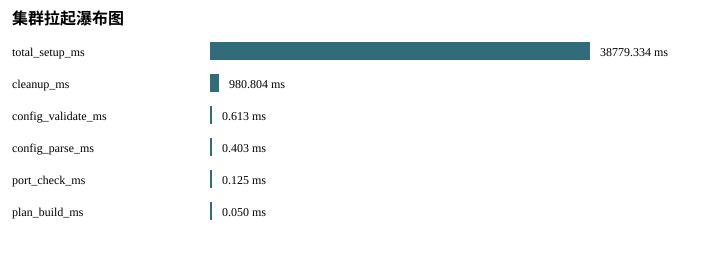
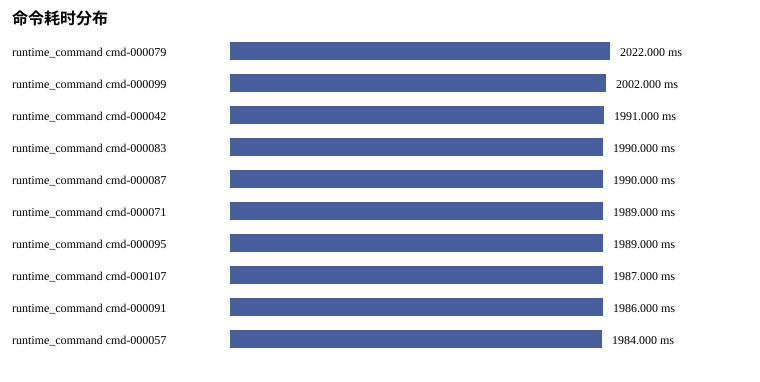
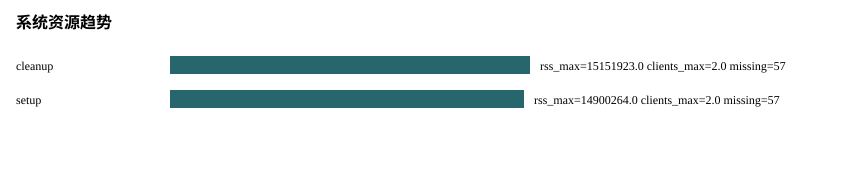

# 中文自动化可视化分析报告

状态: PASS
来源阶段: M1-S07

## 总览页

本报告由本地 artifact 自动生成，不调用 LLM、不访问外网、不依赖在线图表服务。所有结论来自 schema 化 JSON/JSONL、CSV 和本地 SVG 产物。

## 结论摘要

- 主要启动耗时: total_setup_ms = 38779.334 ms。
- 最慢节点: MISSING，ready_ms=MISSING。
- 最慢命令: cmd-000079 runtime_command = 2022 ms。
- 最慢管理操作: MISSING = MISSING ms。
- Workload 瓶颈窗口: MISSING MISSING，p99=MISSING ms，错误率=MISSING。
- Failover p95=MISSING ms；split-brain max=MISSING ms。
- 资源异常节点: shard-0001-replica-00，rss_max=15151923.0 bytes。
- Cleanup 状态: PASS，剩余资源=[]。
- 缺失指标数量: 24；缺失项保留原因，不用估算值替代。

## 运行元数据

- run_id: MISSING: run_id absent from run metadata
- created_at: MISSING: created_at absent from run metadata
- git_sha: MISSING: git_sha absent from run metadata
- valkey_version: MISSING: valkey_version absent from run metadata
- artifact_root: MISSING: artifact_root absent from run metadata

## 分析发现

- source_phase: PASS
- real_valkey_evidence: PASS
- failover: SKIPPED_WITH_REASON
- cleanup: PASS
- setup_telemetry: PASS
- command_audit: PASS
- management_ops: SKIPPED_WITH_REASON
- workload_benchmark: SKIPPED_WITH_REASON
- fault_timeline: SKIPPED_WITH_REASON
- system_metrics: PASS

## 集群拉起瀑布图

## 阶段耗时排序

- total_setup_ms: 38779.334 ms
- cleanup_ms: 980.804 ms
- config_validate_ms: 0.613 ms
- config_parse_ms: 0.403 ms
- port_check_ms: 0.125 ms
- plan_build_ms: 0.05 ms

## 慢节点 TopN

- SKIPPED_WITH_REASON: Slow-node ranking requires numeric per-node readiness samples.

## 慢命令 TopN

- cmd-000079 runtime_command: 2022 ms status=PASS
- cmd-000099 runtime_command: 2002 ms status=PASS
- cmd-000042 runtime_command: 1991 ms status=PASS
- cmd-000083 runtime_command: 1990 ms status=PASS
- cmd-000087 runtime_command: 1990 ms status=PASS
- cmd-000071 runtime_command: 1989 ms status=PASS
- cmd-000095 runtime_command: 1989 ms status=PASS
- cmd-000107 runtime_command: 1987 ms status=PASS
- cmd-000091 runtime_command: 1986 ms status=PASS
- cmd-000057 runtime_command: 1984 ms status=PASS

## 失败命令

- none

## 重试命令

- none

## 命令审计覆盖

- total_commands: 115
- cleanup: 10
- cluster_probe: 42
- runtime_command: 63

## 管理操作矩阵

- SKIPPED_WITH_REASON: Input artifacts did not include management_ops_matrix.json or management_operation_results.jsonl.

## 管理 topology diff 摘要

- SKIPPED_WITH_REASON: 无 topology diff 样本

## Workload 基准压测

- SKIPPED_WITH_REASON: Input artifacts did not include workload_windows.json or workload_report.json.

## 故障 Timeline

- SKIPPED_WITH_REASON: Input artifacts did not include fault_timeline_report.json or fault_timeline_events.jsonl.

## Failover 延迟分布

- failover_latency: p50=MISSING ms, p95=MISSING ms, max=MISSING ms, status=MISSING
- promotion_latency: p50=MISSING ms, p95=MISSING ms, max=MISSING ms, status=MISSING
- client_unavailability: p50=MISSING ms, p95=MISSING ms, max=MISSING ms, status=MISSING
- workload_recovery: p50=MISSING ms, p95=MISSING ms, max=MISSING ms, status=MISSING

## Split-brain 窗口

- split_brain_window: p95=MISSING ms, max=MISSING ms, status=MISSING
- cluster_down_window: p95=MISSING ms, max=MISSING ms, status=MISSING

## 故障期间 Workload 影响

- SKIPPED_WITH_REASON: Input artifacts did not include fault_timeline_report.json or fault_timeline_events.jsonl.

## 系统资源趋势

- cleanup: rss_max=15151923.0 bytes, connected_clients_max=2.0, missing_count=57
- setup: rss_max=14900264.0 bytes, connected_clients_max=2.0, missing_count=57

## 系统异常节点 TopN

- shard-0001-replica-00: rss_max=15151923.0 bytes, used_memory_max=2993864.0 bytes, missing_count=18
- shard-0002-replica-00: rss_max=14900264.0 bytes, used_memory_max=2993672.0 bytes, missing_count=18
- shard-0000-replica-00: rss_max=14889779.0 bytes, used_memory_max=2994312.0 bytes, missing_count=18
- shard-0000-primary: rss_max=14638120.0 bytes, used_memory_max=3092760.0 bytes, missing_count=20
- shard-0001-primary: rss_max=14313062.0 bytes, used_memory_max=3067880.0 bytes, missing_count=20
- shard-0002-primary: rss_max=14313062.0 bytes, used_memory_max=3067752.0 bytes, missing_count=20

## 缺失指标

- fault_timeline.row_count: SKIPPED_WITH_REASON - Fault timeline artifacts were not present.
- management.operation_count: SKIPPED_WITH_REASON - Management operation artifacts were not present.
- setup.cluster_convergence_probe_ms: SKIPPED_WITH_REASON - This metric is only available after a live local setup reaches the corresponding runtime step.
- setup.cluster_meet_ms: SKIPPED_WITH_REASON - This metric is only available after a live local setup reaches the corresponding runtime step.
- setup.cluster_slots_assign_ms: SKIPPED_WITH_REASON - This metric is only available after a live local setup reaches the corresponding runtime step.
- setup.full_cluster_probe_ms: SKIPPED_WITH_REASON - This metric is only available after a live local setup reaches the corresponding runtime step.
- setup.node_config_distribute_ms: SKIPPED_WITH_REASON - This metric is only available after a live local setup reaches the corresponding runtime step.
- setup.node_config_generate_ms: SKIPPED_WITH_REASON - This metric is only available after a live local setup reaches the corresponding runtime step.
- setup.nodehost_start_ms: SKIPPED_WITH_REASON - This metric is only available after a live local setup reaches the corresponding runtime step.
- setup.process_ready_wait_ms: SKIPPED_WITH_REASON - This metric is only available after a live local setup reaches the corresponding runtime step.
- setup.process_start_ms: SKIPPED_WITH_REASON - This metric is only available after a live local setup reaches the corresponding runtime step.
- setup.replica_replicate_ms: SKIPPED_WITH_REASON - This metric is only available after a live local setup reaches the corresponding runtime step.
- setup.resource_preflight_ms: SKIPPED_WITH_REASON - Resource preflight is only executed by stages that require bounded scale admission.
- system.cpu_system_percent: MISSING - Docker stats exposes aggregate CPU percent, not per-process system CPU percent
- system.cpu_user_percent: MISSING - Docker stats exposes aggregate CPU percent, not per-process user CPU percent
- system.fd_count: MISSING - fd_count requires container namespace inspection and is unsupported by the safe Docker stats path
- system.log_error_count: MISSING - log file was unavailable for error counting
- system.replication_lag: MISSING - Valkey INFO does not expose a direct replication_lag metric in all roles
- system.rx_packets: MISSING - Docker stats NetIO does not expose packet counters
- system.slave_repl_offset: MISSING - Valkey INFO did not include slave_repl_offset
- system.tcp_retransmits: MISSING - TCP retransmits require host or namespace TCP diagnostics and are unsupported in the safe default collector
- system.tx_packets: MISSING - Docker stats NetIO does not expose packet counters
- system.vms_bytes: MISSING - container-scoped VMS is not exposed by Docker stats
- workload.window_count: SKIPPED_WITH_REASON - Workload benchmark artifacts were not present.

## 生成表格

- metrics.csv
- missing_metrics.csv
- baseline_comparison.csv
- setup_phase_durations.csv
- setup_slowest_nodes.csv
- command_slowest.csv
- command_failures.csv
- command_retries.csv
- management_ops_matrix.csv
- management_operation_durations.csv
- management_topology_diffs.csv
- management_rolling_restart.csv
- management_reshard_rebalance.csv
- workload_benchmark_windows.csv
- workload_profile_summary.csv
- fault_timeline_events.csv
- fault_timeline_summary.csv
- failover_latency_distribution.csv
- split_brain_windows.csv
- fault_workload_impact.csv
- system_metrics_by_window.csv
- system_metrics_abnormal_nodes.csv
- metric_chart.svg
- setup_waterfall.svg
- command_latency.svg
- management_operation_duration.svg
- management_topology_diff.svg
- workload_qps_p99_error.svg
- fault_timeline.svg
- failover_latency_distribution.svg
- split_brain_window.svg
- fault_workload_impact.svg
- system_resource_trends.svg
