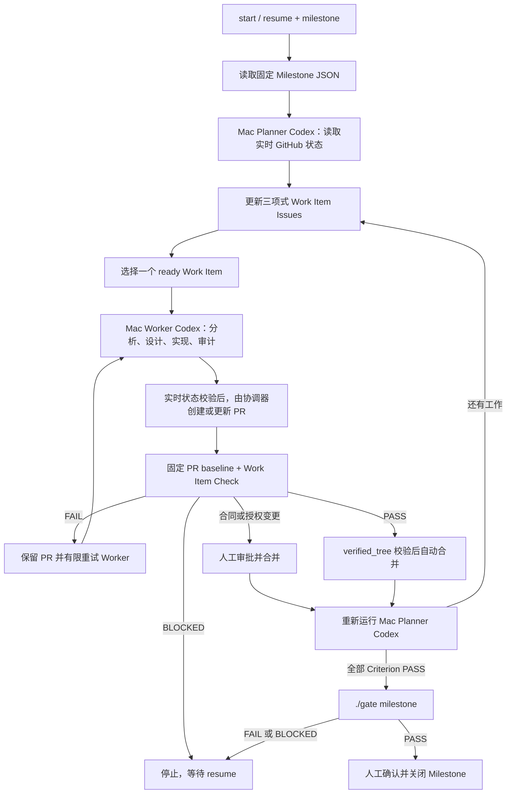

# valkey-scale-lab 方案四：GitHub 控制面 + 本地 Mac Codex 执行与真实验证

状态：讨论基线
更新日期：2026-07-18

## 硬约束

* Agent 必须使用 Codex。
* 所有 Codex 运行必须发生在本地 macOS，而不是 GitHub-hosted runner。
* 可以使用 Codex CLI 或 Codex App；主自动执行器选择 Codex CLI。
* 真实 Valkey 集群验证必须在本地 Mac 环境执行，不能用云端模拟验证替代。
* 完成一个工作项后必须重新评估 Milestone，并允许自动调整、废弃或新增
  剩余工作项。
* “已接受实现进展”和 `Criterion PASS` 是两个不同状态：前者只表示一个
  工作项的显式准入检查通过并已合并，后者只能由 Milestone JSON 绑定的
  可执行 Check 给出。
* 需要真实环境的 Check 必须自行执行 Authorization Lease 预检；没有有效
  lease 时返回 `BLOCKED`，Loop 立即停止，不能降级或改用 fixture。
# 当前威胁模型防止错误计划、错误代码、残留污染、凭据意外继承、状态撕裂和未验证结果冒充 PASS；不假设多个 Agent 会互相攻击，也不把恶意内核攻陷列为P0。因此不强制第二台物理 Mac、macOS VM 或通用安全策略平台。
* 普通功能 PR 在受信准入通过后默认自动合并；合同、授权和 Milestone 最终
  关闭仍由人工审批，以保证长期运行不在每个普通工作项处等待。
* 仓库只有一个 workflow：`.github/workflows/milestone-loop.yml`。
  `workflow_dispatch` 只接受 `action`（`start | resume`）和 `milestone`
  （`m1 | m2 | m3`）两个输入；启动后固定读取
  `project/milestones/<milestone>/milestone.json`。
* 普通 PR baseline 固定执行 `./gate suite repository.all`；Milestone 最终验收
  固定执行 `./gate milestone <milestone>`，均不可由 Issue、PR 或 Agent 改写。
* Loop 的领域模型只包含 Milestone、Criterion、Check、Work Item、
  `PASS` / `FAIL` / `BLOCKED` 和 Authorization Lease。执行环境、规模、产品版本
  以及证据字段均为 Milestone Check 的内部合同，Loop 不解析也不复制。

## 1. 能实现什么

GitHub 保存 Milestone、Issue、PR、审核意见和 Check 结果，并决定何时启动
下一轮。Mac 同时承担两种本地 Codex 运行：

* Planner Codex：在 Milestone 启动以及每个已接受工作项完成后，重新读取
  Milestone、代码、Issues、Labels、PR、Checks 和人工意见，动态调整 Work
  Item。
* Worker Codex：选择一个当前可执行的工作项，在本地完成分析、设计、实现、
  审计和快速验证，产出本地候选提交；确定性协调步骤在重新校验实时状态后
  才 push 并创建或更新 PR。

代码候选提交之后，再由一个不使用 Agent 的确定性 Mac verifier Job 使用
独立 checkout 验证候选。每个候选运行该 Work Item 的 `Check:`；是否需要真实
环境、何时运行以及如何验收均由 Check 自己决定。工作项准入通过并完成合并，
只表示一次“已接受实现进展”，不能自动推出任何 Criterion 已经 PASS。

verifier 把 Check 结论绑定到 `base_sha`、`head_sha` 和按仓库合并策略生成的
`verified_tree`，但不解析 Check 的内部证据字段。默认分支或候选发生变化时，
原验证立即失效；只有最终将写入默认分支的 tree 与 `verified_tree` 相同，才
允许把合并计为已接受进展。

Criterion PASS 只能由
`project/milestones/<milestone>/milestone.json` 已绑定的可执行 Check 给出。
需要真实环境的 Check 自己理解执行环境、规模、产品版本、证据字段和 cleanup
合同，并自行执行 Authorization Lease 预检；Loop 只接收 Check 返回的
`PASS`、`FAIL` 或 `BLOCKED`。Criterion 尚无 Check 时，Milestone 只能保持
`BLOCKED`。

完成工作项 1 后，Planner 可以：

* 创建新发现的工作项。
* 修改因最新代码而变化的剩余工作项。
* 增加或解除依赖。
* 将不再需要的工作项标记为 `superseded`。
* 选择新的可执行 Work Item。

因此，工作队列不是一次性静态拆分，而是在每次已接受进展后重新计算。

## 2. 复用哪些现有能力

* GitHub Actions 的 macOS self-hosted runner、`workflow_dispatch`、
  concurrency、Checks、artifacts 和 Environment。
* Codex CLI 的 `codex exec`、JSONL 事件、结构化输出、沙箱和本地
  subagents。
* Goal 的固定分支、单一 PR、Issue 状态评论和确定性选择思路；不复用它的
  Goal 状态模型。
* gh-aw 的 WorkQueueOps、OrchestratorOps、幂等、单工作项逐轮处理和
  safe-output 思想。
* 本项目已有的 Milestone JSON、Catalog、`./gate`、证据和 cleanup 合同；
  这些执行细节由 Milestone Check 封装，Loop 不解析。

`gh-aw` Agent runtime 不进入关键执行路径。其官方 self-hosted runner 要求
Linux 和 Docker，明确不支持 macOS；强行把它放进本方案，需要增加远程
engine bridge 或 Linux 虚拟机，而且 Codex 将不再直接运行于 macOS。

Codex App Scheduled Tasks 也不作为主调度器。它适合本地定时运行，但不能
直接响应 GitHub 事件，并要求电脑和应用持续运行。Codex CLI 的
`codex exec` 原生面向脚本和 CI，更适合由 GitHub runner 调用。Codex App
仍可用于人工查看、调试和干预。

## 3. 新增组件、状态、协议、边界和运维

新增运行组件：

* 同一台本地 Mac 上安装两个以 `launchd` 运行的 GitHub Actions
  self-hosted runner，分别使用独立 macOS 服务账号和标签：
  `[self-hosted, macOS, valkey-codex]` 只运行 Planner/Worker，
  `[self-hosted, macOS, valkey-verify]` 只运行 coordinator、baseline 和
  Milestone Check。
* 唯一的 GitHub Actions workflow
  `.github/workflows/milestone-loop.yml`，负责普通 PR baseline，以及在手工启动
  后决定本轮运行 Planner、Worker、Check 还是最终验收。
* 一个工作上下文生成脚本，将当前 Milestone、当前 Work Item、它直接声明的
  依赖、相关 Check 结果、人工意见和仓库约束提供给 Codex。
* 一个很小的确定性协调脚本，负责受保护合同检查、从 Checks 计算失败签名和
  重试次数、在 PR/Checks 中绑定 `base_sha`/`head_sha`/`verified_tree`、实时
  GitHub 状态复核和 cleanup。
* 一个 hermetic `milestone-loop.selftest`，使用本地 fixture 和 fake GitHub API
  验证协调规则，不进入 `project/` Catalog。

除 workflow 外，上述 context builder、受信 prompt、coordinator 和 verifier
辅助脚本统一放在 `.github/milestone-loop/`。
`project/` 只保存产品代码、产品测试和产品/Milestone 可执行 Check；控制面
不得进入 `project/`，也不得创建、修改或读取 `loop_evidence/` 作为运行状态。

不新增数据库、常驻 Web 服务、本地任务数据库或通用 Agent 框架。

工作上下文脚本解决的具体缺口：

* Goal 主要把选中的单个 Issue 交给 Agent，不会自动提供本项目的 Milestone
  JSON、Criterion、依赖关系和 Check 结果。
* Codex 可以自己查询这些信息，但每轮自由拼接容易遗漏关键验收条件。
* 每轮上下文读取 Milestone JSON、当前 Work Item、它直接依赖的 Issues、相关
  PR 和 Checks；不复制完整工作图，也不保存上下文快照作为权威状态。
* 上下文有固定字节和条数上限，并输出内容清单与
  `context_truncated=false`。权威当前状态本身超过上限时转为 `BLOCKED`，
  不能静默截断或让 Codex 猜测缺失内容。
* 脚本只收集和规范化现有信息，不做 Agent 决策。

Work Item 合同：

* 不定义 Work Item JSON Schema。每个 Work Item Issue 只要求正文中有三行：

  ```text
  Criterion: ...
  Depends on: ...
  Check: ...
  ```
* `Criterion` 引用 Milestone JSON 中的 Criterion；`Depends on` 引用前置 Issue，
  无依赖时写 `none`；`Check` 引用可执行 Check。
* gap 和 objective 由 Issue 的普通正文表达；状态只由 Labels 表达；预期进展只
  由 Check 结果表达。不增加 `gap`、`objective`、`status`、
  `expected_progress` 等机器字段。
* Planner 直接根据实时 Issues 和 Labels 创建、修改、废弃 Work Item。协调器
  只校验上述三行、引用存在性和依赖无环，不生成或持久化完整工作图副本。

workflow 约束：

* 仓库中只有 `.github/workflows/milestone-loop.yml`；不增加 baseline、Check、
  watchdog 或 recovery 专用 workflow。
* `workflow_dispatch` 只声明两个必填输入：`action` 的枚举是 `start | resume`，
  `milestone` 的枚举是 `m1 | m2 | m3`。其他值必须在运行任何本地代码前拒绝。
* `start` 和 `resume` 都固定读取
  `project/milestones/<milestone>/milestone.json`，不能接受路径、Check、命令、
  backend、规模、版本或证据字段作为输入。
* `pull_request` 路径固定运行 `./gate suite repository.all`。Loop 完成所有
  Criterion 后固定运行 `./gate milestone <milestone>` 进行最终验收。
* GitHub Actions 的 Job 图是静态的；需要下一轮时，当前 workflow 使用相同
  `milestone` 和 `action=start` 自行 dispatch，仍只传递这两个输入；
  `action=resume` 只用于从 `BLOCKED` 恢复。
* 每次 `start` 或 `resume` 都先从 Issues、Labels、PR 和 Checks 重新协调状态并
  执行 recovery cleanup；不依赖定时 watchdog 或另一个 workflow。

状态来源：

* GitHub Milestone：进度视图。
* 仓库 Milestone JSON：最终目标和验收标准的唯一权威。
* Issues：Work Item 正文以及三项必需引用。
* Labels：Work Item 的 ready、in-progress、blocked、review、completed 和
  superseded 状态。
* PR 和 Checks：候选修改、审阅状态和 Check 结果。
* 默认分支 HEAD：已经接受的代码状态。
* Milestone Control Issue 只记录 Authorization Lease 和 Milestone 级
  no-progress count，不保存 JSON 状态机或其他运行状态。
* Check 可以保留自己的有期限 artifacts；它们不是 Loop 状态，Loop 只读取
  GitHub Check 的 `PASS`、`FAIL` 或 `BLOCKED` 结论。

控制协议：

* 同一时间最多一个 ready Work Item，避免 Mac 上并行修改相互冲突。
* workflow 为 Planner/Worker 固定 wall-clock timeout 和 JSONL silence
  timeout；超限时终止 `codex exec`，保存有界诊断并清理隔离 worktree。这些
  值不是 dispatch 输入或 Control Issue 状态。
* Planner 在初始启动和“已接受实现进展”之后重新读取 Issues、Labels、PR 和
  Checks，再调整 Work Item；一次普通失败不立即重写计划，但达到无进展阈值时
  允许做一次受限的失败诊断。
* Worker 只能提交候选 PR，不能自行宣布工作有效完成。
* push 或更新 PR、开始 Check、启用 auto-merge 和执行最终 merge 之前，协调器
  都必须重新读取 Issue、Labels、PR 和 Checks，确认 Work Item 仍可执行且
  commit/tree 未失效；不匹配时只允许 cleanup 后退出。
* 每个普通功能 PR 都必须对 `verified_tree` 固定运行
  `./gate suite repository.all`；Work Item 的 Check 只能叠加，不能删除、缩小
  或替代 baseline。
* verifier 对 `base_sha`、`head_sha` 和 `verified_tree` 运行 Work Item 的
  `Check:`。Check 自己解释所有执行参数和证据合同，并在需要时预检及消费
  Authorization Lease。
* Check 返回 `BLOCKED` 时 Loop 立即停止 self-dispatch；缺少有效 lease 时不得
  改跑其他 Check、缩小验证范围或使用 fixture。
* 同一失败签名连续 2 次，或同一工作项累计 3 次代码/验证失败时，停止 Worker
  重试并调用 Planner 做一次失败诊断。失败诊断只能拆分当前工作项、新增前置
  工作或依赖，或标记 `BLOCKED`；不得降低 Criterion 或删除所需 Check。
* 基础设施、认证或授权失败不计为代码失败；同类失败重试一次仍失败即暂停，
  不让 Planner 用修改代码掩盖环境问题。
* Planner 或 Worker 输出缺少必需内容时，不得 push 或验证；只允许一次携带
  原输出和确定性校验错误的 repair 调用。再次失败、wall-clock 超时或 silence
  超时后返回 `BLOCKED`，不计作代码失败，也不自动反复调用 Codex。
* 协调器只从默认分支和受信 Check 计算确定性进展信号。自然语言说明、仅关闭
  Issue 或调整 Work Item 不算进展；每次无进展只增加 Control Issue 中的
  no-progress count，出现确定性进展时重置。达到阈值时运行一次全局 Planner
  审计，审计后再次达到阈值仍无进展则返回 `BLOCKED`。
* 受保护合同集合包括 `project/milestones/**`、`project/catalog.json`、
  `project/verification/**`、`project/gate`、当前 Milestone Check 从默认
  分支实际引用的准入执行链，以及唯一 workflow、coordinator 和 verifier。
  触及这些内容的变更必须标记为
  `contract-change`，作为独立 PR 人工审阅并先行合并；普通功能 PR 不得
  同时改写并通过自己的合同。
* 只有 Milestone JSON 中已绑定的可执行 Check 才能给出 Criterion PASS；
  Work Item 的 completed Label 只表示工作项已合并，不表示 Criterion 或
  Milestone PASS。
* 合并前必须再次确认默认分支仍等于已验证的 `base_sha`，候选仍等于
  `head_sha`，且最终 tree 等于 `verified_tree`；任一变化都必须重新验证。
* 验证失败时 PR 不合并，默认分支不变，因此通常不需要自动回滚。
* 普通功能 PR 在固定 baseline、Work Item Check 和 `verified_tree`
  校验通过后自动合并；`contract-change`、授权租约签发或变更、受保护合同
  路径和 Milestone 最终关闭必须人工审批。
* `BLOCKED` 的唯一恢复入口是
  `workflow_dispatch(action=resume, milestone=<m1|m2|m3>)`。resume 先执行
  recovery cleanup，并重新读取 Milestone JSON、Issues、Labels、PR、Checks
  和 Authorization Lease；仍有 blocker 时保持 `BLOCKED`。通过后只 dispatch
  一轮，不创建新的运行状态对象。
* Planner 将工作项标记为 blocked 或 superseded 时，协调器立即禁用旧 PR 的
  auto-merge 并标记 PR；不存在需保留的人工修改时关闭该 PR。
* `milestone-loop.selftest` 必须覆盖输入枚举、固定 Milestone 路径、三行 Work
  Item 合同、单一 ready、实时状态复核、lease 耗尽、recovery cleanup、固定
  Gate 命令和 `verified_tree` 失效；首次启用和每个 `contract-change` PR 必跑。
* PR 合并后立即重新运行 Planner，而不是直接沿用旧队列。
* Planner 不得自行修改 Milestone 验收标准；需要修改合同时必须等待人工。
* 所有 Criterion PASS 后固定执行 `./gate milestone <milestone>`；只有该命令
  PASS 才能进入 Milestone 最终人工关闭。
* 无可执行工作、达到停止条件或需要人工决定时，停止 self-dispatch。

信任边界：

* 只从默认分支上的受审 workflow 调度本地 runner。
* 不让 fork PR 或未经授权的 Issue 事件直接在 Mac 上执行任意代码。
* Codex 在隔离 worktree 中修改代码。
* Codex 进程不持有 GitHub 写权限；本地候选完成后，由 Codex 进程之外的
  确定性协调步骤在实时状态检查通过后 commit/push 并创建或更新 PR。
* Planner/Worker 的 checkout 使用 `persist-credentials: false`，其进程只
  获得 OpenAI 认证和隔离 worktree 权限，不能读取 GitHub 写 token 或
  Milestone Check 的真实环境凭据。
* baseline verifier 不运行 Codex，也不获得真实环境凭据。需要真实环境的
  Milestone Check 是独立非 Codex Job；由 Check 自己验证 Authorization Lease
  后，才通过受保护 Environment/OIDC 注入其合同要求的短期凭据。临时凭据文件
  只在该 Job 创建，收紧权限并在 cleanup 中删除。
* 普通功能 PR 的受信准入计划和断言来自验证开始时的默认分支 `base_sha`；
  候选新增的测试可以同时运行，但不能单独证明本 PR PASS。
* verifier 使用独立 checkout、独立 artifact root 和固定工具链，不复用
  Codex 的工作目录；运行前检查残留和资源状态，结束时无论成功失败都执行
  cleanup，并在运行后验证零残留。
* 需要远端资源的 Check 必须按自己的合同维护可发现的 ownership 标识；相关
  资源明细不写入 Control Issue，也不进入 Loop 状态。
* Milestone Check 凭据、Codex 登录状态和本地工具凭据只保存在 Mac。
* 最终有效性由固定 Gate 命令和 Check 结论决定，而不是 Agent 的自然语言结论。

运维要求：

* Mac 必须开机、保持唤醒，并保证 GitHub runner 服务在线。
* Codex runner 和 verifier runner 使用不同的专用 macOS 用户，避免共享
  `CODEX_HOME`、个人工作目录、凭据文件和环境变量。
* 固定 Codex CLI、GitHub runner 和项目依赖版本。
* Codex 使用本地账户认证，或只在单次 `codex exec` 调用范围内提供
  `CODEX_API_KEY`。
* Loop runner 的本地环境合同只包含运行控制面所需的 macOS/架构、Codex CLI、
  GitHub runner、Python、lockfile/关键依赖摘要和 verifier 版本；每轮开始采集并
  比对。Milestone Check 需要的产品和真实环境指纹由 Check 自己定义和验证。
* 需要真实资源的 Check 自己维护资源预检、运行超时、独立 artifact root、
  finally cleanup 和运行后零残留检查；任一内部预检失败都只向 Loop 返回
  `BLOCKED`。
* runner 启动以及 `resume` 的第一步执行 recovery cleanup。cleanup 未 PASS
  时转为 `BLOCKED`，不得启动新的 Planner、Worker 或 Check。
* 需要授权的 Check 在执行前自行校验并消费 Authorization Lease；无效时返回
  `BLOCKED` 并停止 self-dispatch。
* 使用 GitHub concurrency 保证同一 Milestone 只有一个 loop 运行。
* Mac 离线时 Job 最多排队 24 小时；自托管 Job 单次最长运行 5 天。

## 4. 主要使用方式

1. 在 GitHub 创建 Milestone，并确保默认分支存在
   `project/milestones/<milestone>/milestone.json`。
2. 手工运行 `.github/workflows/milestone-loop.yml`，只选择
   `action=start` 和 `milestone=m1|m2|m3`。
3. workflow 固定读取对应 Milestone JSON，GitHub 把 Planner Job 排队到本地
   Mac。
4. Planner 读取实时 Issues、Labels、PR 和 Checks，创建或调整 Work Item
   Issues；每个 Issue 只提供 `Criterion:`、`Depends on:`、`Check:` 三项必需
   引用。
5. 确定性协调器校验三项引用和依赖无环，然后只标记一个 ready Work Item。
6. Worker Codex 获得当前 Work Item 和直接依赖，完成探索、设计、实现和审计，
   但只产出本地候选。
7. 协调器重新读取 Issue、Labels、PR 和 Checks 后，才推送固定工作分支并创建
   或更新 PR。
8. 唯一 workflow 的 PR 路径固定执行 `./gate suite repository.all`；verifier
   记录 `base_sha`、`head_sha` 和 `verified_tree`，并叠加执行 Work Item 的
   `Check:`。
9. Check 自行处理参数、证据和 Authorization Lease 预检。返回 `BLOCKED` 时
   Loop 停止，不降级、不改用 fixture；返回 `FAIL` 时保留 PR 并按有限重试规则
   修复；返回 `PASS` 后才允许继续合并判断。
10. 合并步骤再次校验默认分支、候选和最终 tree。普通功能 PR 自动合并；合同、
    lease 和最终关闭等待人工审批。合并后 Planner 重新读取实时状态并调整剩余
    Work Item。
11. 没有确定性进展时只更新 Control Issue 的 no-progress count；达到阈值后
    返回 `BLOCKED`。
12. 所有 Criterion 均由绑定 Check 给出 PASS 后，workflow 固定执行
    `./gate milestone <milestone>`。Gate PASS 后才能人工关闭 Milestone。
13. `BLOCKED` 只通过同一 workflow 的 `action=resume` 和相同 `milestone`
    恢复；resume 重新读取全部实时状态和 lease，只启动一轮。

整体工作流：



GitHub self-hosted runner 采用出站连接领取 Job，不需要给 Mac 配置公网 IP、
入站 Webhook 服务或端口转发。

## 5. 主要限制和失败方式

* 本地 Mac 是单点；关机、休眠、网络中断、磁盘不足或 runner 服务停止都会
  中断推进。
* `gh-aw` runtime 的 sandbox、safe outputs 和 Repo Memory 不能直接复用，
  只能复用其模式和约束；本方案需要少量普通 Actions 脚本补齐。
* Planner 仍可能提出不合理的任务调整，因此必须限制可修改范围、操作数量
  以及允许修改的 Issues/Labels，并把验收标准保留为人工管理。
* 上下文生成器若不能在上限内容纳完整当前权威状态，循环会暂停，而不是
  静默丢弃上下文。
* 即使每个 PR 都成功，Milestone 仍可能没有确定性进展；全局无进展阈值会
  停止这种忙碌但不收敛的循环。
* 真实验证可能耗时较长或消耗集群资源，需要明确的超时、资源检查和 cleanup。
* verifier 与 Worker 虽然使用不同 checkout，仍运行在同一台 Mac；若运行前
  残留检查或运行后零残留检查失败，Check 必须返回 `BLOCKED`。
* Mac 掉电或 runner 被强制终止时，进程内 cleanup 可能不执行；方案依赖
  ownership 标识和下一次恢复时的 recovery cleanup，清理失败仍需人工处理。
* 默认分支或候选在真实验证后变化，会使昂贵验证失效并需要重跑。
* Authorization Lease 到期或额度耗尽时，相关 Check 必须返回 `BLOCKED`；
  这是 Check 的资源边界，不得通过降级绕过。
* 受保护合同变更必须人工审阅并先行合并，因此此类工作项不会完全无人值守。
* 普通功能 PR 默认自动合并使系统可以连续运行，但错误通过 Gate 后的影响
  更大，因此固定 baseline、分支保护和受保护合同覆盖必须可靠。
* 本地 Codex 认证过期、OpenAI 配额不足或网络不可用会使当前轮失败。
* Mac、runner 或控制面依赖漂移会使当前轮进入 infrastructure `BLOCKED`。
  Milestone Check 的环境漂移由 Check 自己识别并返回 `BLOCKED`；Loop 不解析
  具体环境或产品版本。
* Issue、PR 或 workflow dispatch 重复到达时，协调脚本必须保持幂等，并由
  concurrency 防止并发执行。

## 6. 默认合并策略

* 普通功能 PR：固定执行 `./gate suite repository.all`，再叠加 Work Item 的
  `Check:`；两者和 `verified_tree` 校验通过后自动合并。
* `contract-change`、授权租约签发或变更、受保护合同路径、Milestone 最终
  关闭：必须人工审批。
* `BLOCKED` 后只通过同一 workflow 的 `action=resume` 恢复；恢复后先重新读取
  实时 GitHub 状态和 Authorization Lease，再执行 recovery cleanup。

## 7. 最小落地顺序

1. 建立唯一 workflow `.github/workflows/milestone-loop.yml`，以及
   `.github/milestone-loop/` 控制面目录、受保护合同集合和
   `milestone-loop.selftest`；不在 `project/` 恢复 Controller。
2. 在同一台 Mac 上配置隔离的 Codex runner 与 verifier runner，固定版本并
   由人工确认 allowed-environment fingerprint。
3. 实现有界 context builder、三行 Work Item 校验、coordinator、
   blocker/reconcile、verifier 和 recovery cleanup；不实现 Work Item JSON
   Schema 或工作图快照。
4. 在唯一 workflow 中固定两个 dispatch 输入、Milestone JSON 路径、普通 PR
   baseline 和 Milestone 最终 Gate；配置分支保护、分级合并和受保护
   Environment/OIDC。
5. 为目标 Milestone 创建 Control Issue，只初始化 Authorization Lease 和
   no-progress count；禁用 Goal、gh-aw scheduler 及其他会修改同一组
   Issues/PR 的调度器。
6. 在不启用自动合并的情况下手工运行至少 3 轮，验证同一 Work Item PR、动态
   调整、幂等 dispatch、实时状态拒绝和 Agent 输出失败处理。
7. 演练 `BLOCKED`/`resume`、Mac/runner 中断、recovery cleanup、lease 耗尽和
   Check 返回 `BLOCKED`；所有演练通过后才启用普通功能 PR 自动合并。
8. 所有 Criterion Check PASS 后，验证唯一 workflow 固定执行
   `./gate milestone <milestone>`，再进行最终人工确认。

## 8. 验收场景

* Goal/gh-aw scheduler 被禁用；仓库只有
  `.github/workflows/milestone-loop.yml`，同时支持 `m1`、`m2`、`m3`。
* `workflow_dispatch` 只有 `action=start|resume` 和 `milestone=m1|m2|m3` 两个
  输入；启动后只读取固定的
  `project/milestones/<milestone>/milestone.json`。
* 无可执行工作时不产生修改、PR 或重复 dispatch。
* context builder 不静默截断；权威当前状态超限时转为 `BLOCKED`。
* 每个 Work Item Issue 只要求 `Criterion:`、`Depends on:`、`Check:`；正文、
  Labels 和 Check 分别表达描述、状态和结果，不存在 Work Item JSON Schema。
* Control Issue 只记录 Authorization Lease 和 no-progress count；其他状态直接
  读取 Issues、Labels、PR 和 Checks，不保存完整工作图或额外运行状态机。
* Worker 无 GitHub 写权限和 Milestone Check 的真实环境凭据；baseline 无
  Codex 和真实环境凭据；需要授权的 Check 只有 lease 预检通过后才取得短期
  凭据。
* 每个普通 PR 都固定执行 `./gate suite repository.all` 并叠加 Work Item
  Check；候选不能修改自己的受信合同。
* blocked、superseded、PR/Check 变化或 commit/tree 失效都能阻止旧 Job push、
  创建资源、启用 auto-merge 或最终 merge。
* Mac/runner 在 Check 中断后，下一次 `resume` 先执行 recovery cleanup；残留未
  清除时不得继续。
* 同一失败、连续合并无进展和 Agent 输出失败都在有限次数后停止，不会
  无限消耗 Codex 或真实资源。
* 普通功能 PR 通过受信检查和 `verified_tree` 校验后自动合并，随后 Planner
  基于新的默认分支动态调整剩余工作。
* 无有效 lease 或 Milestone Check 的内部预检失败时，Check 返回 `BLOCKED`；
  Loop 停止，不能降级、使用 fixture 或由自然语言改成 PASS。
* Loop 不接收也不解析 Milestone Check 的执行环境、规模、产品版本或证据字段；
  这些合同只由 Check 验证，Loop 只消费 `PASS`、`FAIL`、`BLOCKED`。
* 所有 Criterion Check PASS 后固定执行 `./gate milestone <milestone>`；没有其他
  最终验收入口。
* 手工改 label 不能恢复；只有 `action=resume` 重新读取 blocker 后启动一轮。

## 参考

* https://learn.chatgpt.com/docs/non-interactive-mode
* https://learn.chatgpt.com/docs/agent-configuration/subagents
* https://learn.chatgpt.com/docs/automations
* https://docs.github.com/en/actions/reference/runners/self-hosted-runners
* https://docs.github.com/en/actions/concepts/security/github_token
* https://docs.github.com/en/actions/reference/workflows-and-actions/events-that-trigger-workflows
* https://docs.github.com/en/actions/reference/limits
* https://docs.github.com/en/actions/how-tos/manage-workflow-runs/download-workflow-artifacts
* https://docs.github.com/en/repositories/releasing-projects-on-github/about-releases
* https://github.github.com/gh-aw/reference/self-hosted-runners/
* https://github.github.com/gh-aw/patterns/orchestrator-ops/
* https://github.github.com/gh-aw/patterns/workqueue-ops/
* https://raw.githubusercontent.com/githubnext/goal/main/workflows/goal.md
* https://raw.githubusercontent.com/githubnext/goal/main/workflows/scripts/goal_scheduler.py
