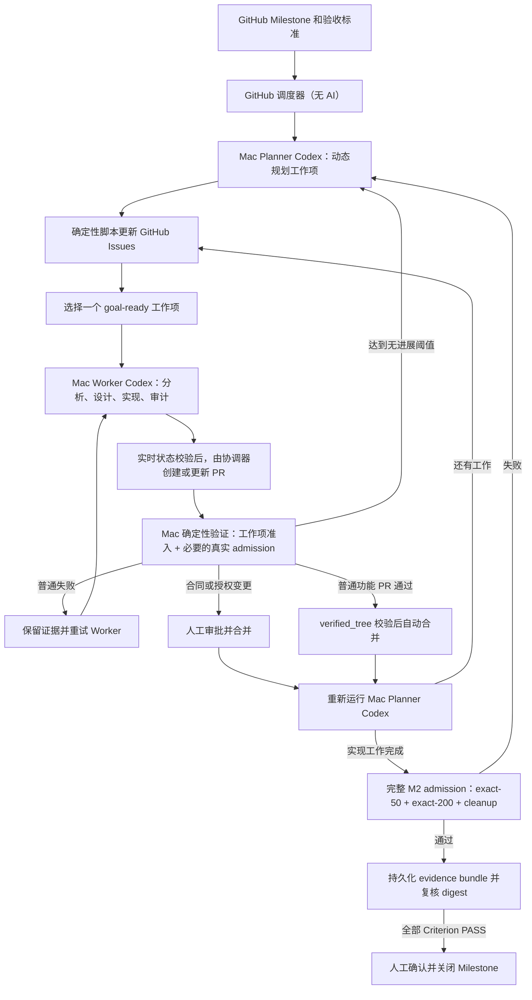

# valkey-scale-lab 方案四：GitHub 控制面 + 本地 Mac Codex 执行与真实验证

状态：讨论基线
更新日期：2026-07-16

## 硬约束

* Agent 必须使用 Codex。
* 所有 Codex 运行必须发生在本地 macOS，而不是 GitHub-hosted runner。
* 可以使用 Codex CLI 或 Codex App；主自动执行器选择 Codex CLI。
* 真实 Valkey 集群验证必须在本地 Mac 环境执行，不能用云端模拟验证替代。
* 完成一个工作项后必须重新评估 Milestone，并允许自动调整、废弃或新增
  剩余工作项。
* “已接受实现进展”和 `Criterion PASS` 是两个不同状态：前者只表示一个
  工作项的显式准入检查通过并已合并，后者只能由 Milestone JSON 绑定的
  可执行 Check 和所需真实证据给出。
* 真实 ECS 验证必须消费人工签发的有限授权；没有授权、授权过期或超出范围时
  必须暂停，不能缩小规模或改用模拟验证继续。
# 当前威胁模型防止错误计划、错误代码、残留污染、凭据意外继承、状态撕裂和未验证结果冒充 PASS；不假设多个 Agent 会互相攻击，也不把恶意内核攻陷列为P0。因此不强制第二台物理 Mac、macOS VM 或通用安全策略平台。
* 普通功能 PR 在受信准入通过后默认自动合并；合同、授权和 Milestone 最终
  关闭仍由人工审批，以保证长期运行不在每个普通工作项处等待。

## 1. 能实现什么

GitHub 保存 Milestone、Issue、PR、审核意见和 Check 结果，并决定何时启动
下一轮。Mac 同时承担两种本地 Codex 运行：

* Planner Codex：在 Milestone 启动以及每个已接受工作项完成后，重新读取
  目标、代码、Issue、PR、验证证据和人工意见，动态调整工作图。
* Worker Codex：选择一个当前可执行的工作项，在本地完成分析、设计、实现、
  审计和快速验证，产出本地候选提交；确定性协调步骤在重新校验实时状态后
  才 push 并创建或更新 PR。

代码候选提交之后，再由一个不使用 Agent 的确定性 Mac verifier Job 使用
独立 checkout 验证候选。每个候选先运行该工作项明确声明的确定性准入检查；
只有在相关分布式能力已经形成可验收候选时，才运行对应的真实 Criterion
admission。工作项准入通过并完成合并，只表示一次“已接受实现进展”，不能
自动推出任何 Criterion 已经 PASS。

verifier 把证据绑定到 `base_sha`、`head_sha` 和按仓库合并策略生成的
`verified_tree`。默认分支或候选发生变化时，原验证立即失效；只有最终将写入
默认分支的 tree 与 `verified_tree` 相同，才允许把合并计为已接受进展。

M2 的 Criterion PASS 只能由
`project/milestones/m2/milestone.json` 已绑定的可执行 Check 给出。真实
admission 必须证明 `backend=native_multi_ecs`、至少两个不同 ECS host、
远端直接管理的 Valkey 进程、精确 requested/observed 50 或 200、独立观测的
真实 Valkey 版本和集群健康、非 fixture/dry-run、跨主机日志和 provenance，
以及 cleanup PASS 和零残留。Criterion 尚无 Check 或任一证据字段缺失时，
Milestone 只能保持 `DEFINED` 或 `BLOCKED`。

完成工作项 1 后，Planner 可以：

* 创建新发现的工作项。
* 修改因最新代码而变化的剩余工作项。
* 增加或解除依赖。
* 将不再需要的工作项标记为 `superseded`。
* 选择新的 `goal-ready` 工作项。

因此，工作队列不是一次性静态拆分，而是在每次已接受进展后重新计算。

## 2. 复用哪些现有能力

* GitHub Actions 的 macOS self-hosted runner、`workflow_dispatch`、定时触发、
  concurrency、Checks、artifacts 和 Environment。
* Codex CLI 的 `codex exec`、JSONL 事件、结构化输出、沙箱和本地
  subagents。
* Goal 的完成合同、固定分支、单一 PR、Issue 状态评论、证据记录和
  `goal_scheduler.py` 的确定性选择逻辑。
* gh-aw 的 WorkQueueOps、OrchestratorOps、幂等、单工作项逐轮处理和
  safe-output 思想。
* 本项目已有的 Milestone JSON、Catalog、`./gate`、证据和 cleanup 合同。
  当前本地 exact-50/exact-200 路径只能复用其执行和证据模式，不能替代 M2
  的 `native_multi_ecs` Criterion admission。

`gh-aw` Agent runtime 不进入关键执行路径。其官方 self-hosted runner 要求
Linux 和 Docker，明确不支持 macOS；强行把它放进本方案，需要增加远程
engine bridge 或 Linux 虚拟机，而且 Codex 将不再直接运行于 macOS。

Codex App Scheduled Tasks 也不作为主调度器。它适合本地定时运行，但不能
直接响应 GitHub 事件，并要求电脑和应用持续运行。Codex CLI 的
`codex exec` 原生面向脚本和 CI，更适合由 GitHub runner 调用。Codex App
仍可用于人工查看、调试和干预。

## 3. 新增组件、状态、协议、边界和运维

新增运行组件：

* 同一台本地 Mac 上安装两个以 `launchd` 运行的 GitHub Actions
  self-hosted runner，分别使用独立 macOS 服务账号和标签：
  `[self-hosted, macOS, valkey-codex]` 只运行 Planner/Worker，
  `[self-hosted, macOS, valkey-verify]` 只运行 coordinator、baseline 和
  real admission。
* 放在 `.github/workflows/` 的普通 GitHub Actions loop workflow，负责决定
  本轮运行 Planner、Worker 还是 verifier。
* 一个工作上下文生成脚本，将完整 Milestone、当前工作项、依赖、历史证据、
  人工意见和仓库约束提供给 Codex。
* 一个 `plan-delta` JSON Schema 和确定性应用脚本。
* 一个很小的确定性协调脚本，负责受保护合同检查、失败签名、重试计数、
  `base_sha`/`head_sha`/`verified_tree` 绑定、`pr.baseline`、授权租约消费、
  ownership 恢复和证据提升。
* 一个 hermetic `goal-loop.selftest`，使用本地 fixture 和 fake GitHub API
  验证控制状态机，不进入 `project/` Catalog。

除 workflow 外，上述 context builder、受信 prompt、`plan-delta` schema 和
applier、coordinator、verifier 辅助脚本统一放在 `.github/goal-loop/`。
`project/` 只保存产品代码、产品测试和产品/Milestone 可执行 Check；控制面
不得进入 `project/`，也不得创建、修改或读取 `loop_evidence/` 作为运行状态。

不新增数据库、常驻 Web 服务、本地任务数据库或通用 Agent 框架。

工作上下文脚本解决的具体缺口：

* Goal 主要把选中的单个 Issue 交给 Agent，不会自动提供本项目的完整
  Milestone JSON、Criterion、依赖关系、Gate 证据和其他工作项状态。
* Codex 可以自己查询这些信息，但每轮自由拼接容易遗漏关键验收条件。
* 每轮上下文包含完整 Milestone、完整当前工作图、当前工作项、各活动项最新
  状态、最近一次相关失败和未解决人工意见；已关闭旧轮次只提供确定性索引、
  digest 和 GitHub/Release 引用，需要时再按引用读取。
* 上下文有固定字节和条数上限，并输出内容清单与
  `context_truncated=false`。权威当前状态本身超过上限时转为 `BLOCKED`，
  不能静默截断或让 Codex 猜测缺失内容。
* 脚本只收集和规范化现有信息，不做 Agent 决策。

`plan-delta` 应用脚本解决的具体缺口：

* Goal 只会从已有 Goal Issue 中选择一个，不会动态拆解 Milestone 或维护
  依赖图。
* gh-aw 的通用队列不了解本项目的 Criterion 和 Gate 语义，并且它的 Agent
  runtime 不能在 Mac 上运行。
* Planner Codex 只输出结构化建议；脚本验证 Schema、操作数量和允许的状态
  迁移后，先在内存构造 prospective graph。
* prospective graph 必须满足：工作项 ID 唯一；依赖均存在且无环；每个未
  PASS Criterion 至少有一个活动工作项或明确的 blocked 原因；存在可执行项
  且未暂停时恰有一个 `goal-ready`，否则为零。任一不变量失败时拒绝整个
  delta、零写入并保留旧图。
* 合法 delta 带唯一 `delta_id`，成功应用后生成单调递增的
  `plan_revision`。只有完成标记写入后新图才生效；API 中途失败时不得选择
  ready 或 dispatch Worker，由 watchdog 继续完成同一 delta 或依据旧图
  重建。

loop workflow 解决的具体缺口：

* GitHub Actions 的 Job 图是静态的，不能在单次运行中形成不受限的长期
  动态循环。
* `workflow_run` 最多只能连续三层，不适合无限推进。
* 每轮结束时使用 `GITHUB_TOKEN` 调用 `workflow_dispatch` 启动下一轮；
  GitHub 明确允许该事件创建新的 workflow run。
* 定时触发只充当 watchdog，在漏掉事件、Mac 短暂离线或上一轮异常退出时
  恢复循环。
* loop 和 watchdog 每次恢复时先 reconcile 状态并执行 recovery cleanup，
  然后才允许 Planner、Worker、验证或合并。

持久状态全部保存在 GitHub：

* GitHub Milestone：进度视图。
* 仓库 Milestone JSON：最终目标和验收标准的唯一权威。
* Issues：动态工作图。
* Labels：`goal-ready`、`goal-in-progress`、`goal-blocked`、
  `goal-review`、`goal-completed` 和 `goal-superseded`。
* PR、Checks、Issue 评论和 artifacts：修改、验证证据、人工意见，以及当前
  `cycle_id`、`delta_id`、`plan_revision`、结构化 blocker 清单和 Milestone
  级无进展计数。
* 默认分支 HEAD：已经接受的代码状态。
* Milestone 控制 Issue 中的结构化真实验证授权租约及每次消费记录。租约至少
  绑定 Milestone、backend、允许的 host 清单、最大节点数、有效期，以及最大
  运行次数或成本上限。
* 每次真实运行在创建资源前写入 Milestone 控制 Issue 的 ownership intent
  manifest，包含 `run_id`、Milestone、commit/tree、授权租约、backend、
  host 清单、统一资源前缀/标签和到期时间；资源创建后逐项补充实际 ID。
* 普通 PR 和失败运行保留有期限的 Actions artifacts。只有 Criterion PASS
  和 Milestone 最终 admission 的完整压缩 evidence bundle 提升为专用
  GitHub Release asset，并按 `verified_tree` 命名。

控制协议：

* 同一时间最多一个 `goal-ready` 工作项，避免 Mac 上并行修改相互冲突。
* Milestone 启动配置包含 Planner/Worker 的 wall-clock timeout 和 JSONL
  silence timeout；超限时终止 `codex exec`，保存有界诊断并清理隔离
  worktree。
* Planner 在初始启动和“已接受实现进展”之后调整工作图；一次普通失败不立即
  重写计划，但达到无进展阈值时允许做一次受限的失败诊断。
* Worker 只能提交候选 PR，不能自行宣布工作有效完成。
* 工作包必须携带当前 `delta_id`、`plan_revision` 和 Issue ID。创建资源、
  push 或更新 PR、开始真实 admission、启用 auto-merge 和执行最终 merge
  之前，协调器都必须重新读取 GitHub 实时状态，确认未 `goal-paused`、工作项
  仍 active、revision/delta 仍当前且 commit/tree 未失效；不匹配时标记为
  stale，只允许 cleanup 后退出。
* 每个普通功能 PR 都必须对 `verified_tree` 运行受保护默认分支定义的
  `pr.baseline`，初始值为 `./gate suite repository.all`；工作项专项检查只能
  叠加，不能删除、缩小或替代 baseline。
* 每个工作项必须声明确定性准入检查；verifier 对
  `base_sha`、`head_sha` 和 `verified_tree` 运行这些检查，并在需要时运行
  对应真实 Criterion admission。
* 同一失败签名连续 2 次，或同一工作项累计 3 次代码/验证失败时，停止 Worker
  重试并调用 Planner 做一次失败诊断。失败诊断只能拆分当前工作项、新增前置
  工作或依赖，或标记 `goal-blocked`；不得降低 Criterion、删除所需 Check 或
  改用较小规模。
* 基础设施、认证或授权失败不计为代码失败；同类失败重试一次仍失败即暂停，
  不让 Planner 用修改代码掩盖环境问题。
* Planner 或 Worker 缺少结构化输出、JSON 无效或 Schema 校验失败时，不得
  进入 applier、push 或验证；只允许一次携带原输出和确定性校验错误的 repair
  调用。再次失败、wall-clock 超时或 silence 超时后转为
  `agent-protocol BLOCKED`，不计作代码失败，也不自动反复调用 Codex。
* Milestone 启动配置包含 `max_merges_without_progress_signal`。协调器只从
  默认分支和受信 Check 计算确定性进展信号，例如新增 Criterion 可执行 Check、
  必需 Check 或证据状态改善、Criterion PASS；自然语言说明、仅关闭 Issue
  或 Planner 改图不算进展。达到阈值时运行一次全局 Planner 审计，审计后再次
  达到阈值仍无确定性信号则把 Milestone 标记为 `goal-blocked`。只有确定性
  信号能重置计数。
* 受保护合同集合包括 `project/milestones/**`、`project/catalog.json`、
  `project/verification/**`、`project/gate`、当前 Milestone Check 从默认
  分支实际引用的准入执行链，以及 loop workflow、verifier、`plan-delta`
  和状态迁移脚本，以及 `pr.baseline` 定义。触及这些内容的变更必须标记为
  `contract-change`，作为独立 PR 人工审阅并先行合并；普通功能 PR 不得
  同时改写并通过自己的合同。
* 只有 Milestone JSON 中已绑定的可执行 Check 才能给出 Criterion PASS；
  `goal-completed` 只表示工作项已合并，不表示 Criterion 或 Milestone PASS。
* 合并前必须再次确认默认分支仍等于已验证的 `base_sha`，候选仍等于
  `head_sha`，且最终 tree 等于 `verified_tree`；任一变化都必须重新验证。
* 验证失败时 PR 不合并，默认分支不变，因此通常不需要自动回滚。
* 普通功能 PR 在 `pr.baseline`、专项检查、所需真实检查和 `verified_tree`
  校验通过后自动合并；`contract-change`、授权租约签发或变更、受保护合同
  路径和 Milestone 最终关闭必须人工审批。
* `goal-paused` 是唯一全局暂停开关；暂停时不 dispatch 新工作、不验证、
  不合并，但仍允许安全 cleanup。恢复后必须先 reconcile，再选择下一动作。
* `goal-blocked` 和 `goal-paused` 的唯一恢复入口是
  `workflow_dispatch(action=resume, milestone=m2)`。resume 先重新执行
  recovery cleanup、环境指纹、合同和图不变量、授权/凭据、PR/Check 及人工
  blocker 检查；仍有 blocker 时保持停止并输出清单。全部通过后生成新的
  `cycle_id` 和 `plan_revision`，废止旧 Job/auto-merge，并只 dispatch 一轮。
  手工修改 label 本身不能恢复执行，reconcile 会按结构化权威状态纠正 label。
* Planner 将工作项标记为 blocked 或 superseded 时，协调器立即禁用旧 PR 的
  auto-merge 并标记 PR；不存在需保留的人工修改时关闭该 PR。
* `goal-loop.selftest` 必须覆盖 delta 幂等 replay、GitHub API 半失败续写、
  单一 ready、不变量拒绝、暂停和 stale Job、租约耗尽、recovery cleanup
  状态机和 `verified_tree` 失效；首次启用和每个 `contract-change` PR 必跑，
  普通产品 PR 不重复运行。
* PR 合并后立即重新运行 Planner，而不是直接沿用旧队列。
* Planner 不得自行修改 Milestone 验收标准；需要修改合同时必须等待人工。
* 无可执行工作、达到停止条件或需要人工决定时，停止 self-dispatch。

信任边界：

* 只从默认分支上的受审 workflow 调度本地 runner。
* 不让 fork PR 或未经授权的 Issue 事件直接在 Mac 上执行任意代码。
* Codex 在隔离 worktree 中修改代码。
* Codex 进程不持有 GitHub 写权限；本地候选完成后，由 Codex 进程之外的
  确定性协调步骤在实时状态检查通过后 commit/push 并创建或更新 PR。
* Planner/Worker 的 checkout 使用 `persist-credentials: false`，其进程只
  获得 OpenAI 认证和隔离 worktree 权限，不能读取 GitHub 写 token、
  AWS/ECS/SSH/Valkey 凭据。
* baseline verifier 不运行 Codex，也不获得真实环境凭据。real admission 是
  独立非 Codex Job，只有授权租约已经持久化消费后，才通过受保护
  Environment/OIDC 注入短期、限定 backend、host 和操作范围的凭据；临时
  凭据文件只在该 Job 创建，收紧权限并在 cleanup 中删除。
* 普通功能 PR 的受信准入计划和断言来自验证开始时的默认分支 `base_sha`；
  候选新增的测试可以同时运行，但不能单独证明本 PR PASS。
* verifier 使用独立 checkout、独立 artifact root 和固定工具链，不复用
  Codex 的工作目录；运行前检查残留和资源状态，结束时无论成功失败都执行
  cleanup，并在运行后验证零残留。
* 所有远端资源必须带可由 `run_id`、项目统一前缀和到期时间发现的 ownership
  标识，避免进程在 manifest 补写实际资源 ID 前中断时失去归属。
* Valkey 集群凭据、Codex 登录状态和本地工具凭据只保存在 Mac。
* 最终有效性由确定性 Gate、真实集群证据和合并策略决定，而不是 Agent
  的自然语言结论。

运维要求：

* Mac 必须开机、保持唤醒，并保证 GitHub runner 服务在线。
* Codex runner 和 verifier runner 使用不同的专用 macOS 用户，避免共享
  `CODEX_HOME`、个人工作目录、凭据文件和环境变量。
* 固定 Codex CLI、GitHub runner 和项目依赖版本。
* Codex 使用本地账户认证，或只在单次 `codex exec` 调用范围内提供
  `CODEX_API_KEY`。
* Milestone 启动时由人工批准 allowed-environment fingerprint，至少包含
  macOS/架构、Codex CLI、GitHub runner、Python、lockfile/关键依赖摘要和
  verifier 版本；每轮开始先采集并比对本地指纹。
* 真实 admission 还必须采集每个 ECS host 的 OS/镜像、Valkey 版本和
  二进制或包 digest。任一指纹不匹配都属于 infrastructure `BLOCKED`，不计为
  代码失败，不得继续、自动更新允许值或让 Worker 修改产品代码适配漂移。
* 维护真实集群资源预检、磁盘空间检查、运行超时、独立 artifact root、
  finally cleanup 和运行后零残留检查。
* runner 启动、watchdog 恢复和暂停恢复后的第一步，扫描未完成或已过期
  ownership manifest 及远端统一标识，只对已过期且不属于当前活动 Job 的
  项目资源执行确定性 recovery cleanup。cleanup 未 PASS 时记录具体残留和
  归属，转为 `BLOCKED`，不得启动新的 Planner、Worker 或真实验证。
* 真实 ECS Job 在执行前确定性校验并消费授权租约；过期、次数或成本耗尽、
  backend/host/规模不匹配时转为 `BLOCKED` 并停止 self-dispatch。
* 使用 GitHub concurrency 保证同一 Milestone 只有一个 loop cycle 运行。
* Mac 离线时 Job 最多排队 24 小时；自托管 Job 单次最长运行 5 天。

## 4. 主要使用方式

1. 在 GitHub 创建 M2 Milestone，但继续以
   `project/milestones/m2/milestone.json` 为完成标准。
2. 手工启动一次 loop workflow。
3. GitHub 把 Planner Job 排队到本地 Mac。
4. Mac runner 执行 `codex exec`；Planner 生成结构化 `plan-delta`。
5. 确定性脚本验证 prospective graph，以 `delta_id` 幂等写入并发布新的
   `plan_revision`，然后标记一个 `goal-ready` Issue。
6. GitHub 立即 dispatch Worker Job 到同一台 Mac。
7. Worker Codex 获得完整工作包，可使用本地 subagents 完成探索、设计、
   实现和审计。
8. Worker 只产出本地候选；协调步骤实时校验暂停、工作项状态和
   `plan_revision` 后，才推送固定工作分支并创建或更新 PR。
9. 确定性 Mac verifier 记录 `base_sha`、`head_sha` 和 `verified_tree`，
   先运行不可省略的 `pr.baseline` 和工作项专项检查；当该候选已经具备可
   验收的 M2 能力且授权租约有效时，再运行对应的真实 Criterion admission。
10. 代码或验证失败时保留 PR 和证据，再触发 Worker 修复；达到无进展阈值时
    改由 Planner 拆分或补充前置工作。基础设施、认证或授权失败重试一次仍
    失败则暂停。
11. 准入通过后，合并步骤再次校验默认分支、候选和最终 tree。普通功能 PR
    自动合并；合同、授权和最终关闭等待人工审批。合并完成只记为“已接受
    实现进展”，随后立即重新运行 Planner，动态调整剩余工作项。
12. 连续合并达到无进展阈值时先运行一次全局 Planner 审计；审计后再次达到
    阈值仍无确定性进展则转为 `goal-blocked`。
13. 所有实现工作完成后，在已验证的最终候选上运行完整 M2 admission，包括
    `native_multi_ecs` exact-50、exact-200、跨主机证据和 cleanup。
14. Criterion PASS 和最终 admission 的完整 evidence bundle 提升到 GitHub
    Release asset，Issue/Check 记录 Criterion、SHA/tree、文件清单、大小、
    SHA-256 digest、来源 Check、授权消费、实际环境指纹和 cleanup 结果。
15. Milestone 最终人工确认前重新下载全部 admission bundle，校验 digest、
    `verified_tree`、环境指纹和 Criterion 覆盖；缺失或不匹配时转为
    `BLOCKED`。
16. 任何 `BLOCKED` 或人工暂停只通过 `action=resume` 恢复；resume 完整
    reconcile 后生成新 `cycle_id`，只启动一轮。

整体工作流：

GitHub self-hosted runner 采用出站连接领取 Job，不需要给 Mac 配置公网 IP、
入站 Webhook 服务或端口转发。

## 5. 主要限制和失败方式

* 本地 Mac 是单点；关机、休眠、网络中断、磁盘不足或 runner 服务停止都会
  中断推进。
* `gh-aw` runtime 的 sandbox、safe outputs 和 Repo Memory 不能直接复用，
  只能复用其模式和约束；本方案需要少量普通 Actions 脚本补齐。
* Planner 仍可能提出不合理的任务调整，因此必须限制可修改范围、操作数量
  和状态迁移，并把验收标准保留为人工管理。
* 上下文生成器若不能在上限内容纳完整当前权威状态，循环会暂停，而不是
  静默丢弃上下文。
* 即使每个 PR 都成功，Milestone 仍可能没有确定性进展；全局无进展阈值会
  停止这种忙碌但不收敛的循环。
* 真实验证可能耗时较长或消耗集群资源，需要明确的超时、资源检查和 cleanup。
* verifier 与 Worker 虽然使用不同 checkout，仍运行在同一台 Mac；若运行前
  残留检查或运行后零残留检查失败，本次证据必须拒绝并暂停。
* Mac 掉电或 runner 被强制终止时，进程内 cleanup 可能不执行；方案依赖
  ownership 标识和下一次恢复时的 recovery cleanup，清理失败仍需人工处理。
* 默认分支或候选在真实验证后变化，会使昂贵验证失效并需要重跑。
* 真实验证授权租约到期或额度耗尽时循环会暂停；这是资源边界，不得通过
  缩小规模绕过。
* 受保护合同变更必须人工审阅并先行合并，因此此类工作项不会完全无人值守。
* 普通功能 PR 默认自动合并使系统可以连续运行，但错误通过 Gate 后的影响
  更大，因此 `pr.baseline`、分支保护和受保护合同覆盖必须可靠。
* 本地 Codex 认证过期、OpenAI 配额不足或网络不可用会使当前轮失败。
* Mac、runner、依赖或 ECS/Valkey 环境漂移会使当前轮进入 infrastructure
  `BLOCKED`，需要人工确认新的 allowed fingerprint 后才能恢复。
* Issue、PR 或 workflow dispatch 重复到达时，协调脚本必须保持幂等，并由
  concurrency 防止并发执行。

## 6. 默认合并策略

* 普通功能 PR：受信 `pr.baseline`、专项检查、所需真实检查和
  `verified_tree` 校验通过后自动合并。
* `contract-change`、授权租约签发或变更、受保护合同路径、Milestone 最终
  关闭：必须人工审批。
* 人工可随时添加 `goal-paused`；恢复后先 reconcile 和 recovery cleanup。

## 7. 最小落地顺序

1. 在 `.github/workflows/` 和 `.github/goal-loop/` 建立目录边界、受保护合同
   集合和 `goal-loop.selftest`；不在 `project/` 恢复 Controller。
2. 在同一台 Mac 上配置隔离的 Codex runner 与 verifier runner，固定版本并
   由人工确认 allowed-environment fingerprint。
3. 实现有界 context builder、`plan-delta` 校验/applier、coordinator、
   blocker/reconcile、verifier 和 recovery cleanup。
4. 配置分支保护、`pr.baseline`、分级合并、受保护 Environment/OIDC 和
   Release evidence 提升。
5. 创建 M2 控制 Issue、初始授权为空的工作图和 blocker 状态；禁用 Goal、
   gh-aw scheduler 及任何会修改同一 M2 Issue/PR 状态的其他调度器。
6. 在不启用自动合并的情况下手工运行至少 3 个 cycle，验证同一工作项 PR、
   动态重规划、幂等 dispatch、stale Job 拒绝和 agent-protocol 失败处理。
7. 演练 pause/resume、Mac/runner 中断、远端残留发现、recovery cleanup、
   授权耗尽和环境漂移；所有演练通过后才启用普通功能 PR 自动合并。
8. 相关 M2 能力具备可验收候选时，人工签发有限真实验证租约，运行真实
   Criterion admission；最终再运行完整 M2 admission 和证据复核。

## 8. 验收场景

* Goal/gh-aw scheduler 被禁用，只有一个方案四 loop 管理 M2。
* 无可执行工作时不产生修改、PR 或重复 dispatch。
* context builder 不静默截断；权威当前状态超限时转为 `BLOCKED`。
* 非法或半写入 `plan-delta` 不发布新图、不选择 ready，重放同一 `delta_id`
  后结果一致。
* Worker 无 GitHub 写权限和 ECS/SSH 凭据；baseline 无 Codex 和真实环境
  凭据；real admission 只有租约消费后才取得短期凭据。
* 每个普通 PR 都运行 `pr.baseline` 和专项检查，候选不能修改自己的受信合同。
* pause、blocked、superseded 或 stale `plan_revision` 能阻止旧 Job push、
  创建资源、启用 auto-merge 或最终 merge。
* Mac/runner 在真实运行中断后，下一次恢复先执行 recovery cleanup；残留未
  清除时不得继续。
* 同一失败、连续合并无进展和 agent-protocol 失败都在有限次数后停止，不会
  无限消耗 Codex 或真实资源。
* 普通功能 PR 通过受信检查和 `verified_tree` 校验后自动合并，随后 Planner
  基于新的默认分支动态调整剩余工作。
* 无有效租约、环境指纹漂移或真实证据缺失时为 `BLOCKED`，不能缩小规模、
  使用 fixture 或由自然语言改成 PASS。
* M2 exact-50/exact-200 证明确实使用 `native_multi_ecs` 和至少两个 ECS
  host，完整 evidence bundle 可从 Release 下载并通过 digest、tree、
  Criterion 覆盖和 cleanup/零残留复核。
* 手工改 label 不能恢复；只有 `action=resume` 完整重验 blocker 后启动一轮。

## 参考

* https://learn.chatgpt.com/docs/non-interactive-mode
* https://learn.chatgpt.com/docs/agent-configuration/subagents
* https://learn.chatgpt.com/docs/automations
* https://docs.github.com/en/actions/reference/runners/self-hosted-runners
* https://docs.github.com/en/actions/concepts/security/github_token
* https://docs.github.com/en/actions/reference/workflows-and-actions/events-that-trigger-workflows
* https://docs.github.com/en/actions/reference/limits
* https://docs.github.com/en/actions/how-tos/manage-workflow-runs/download-workflow-artifacts
* https://docs.github.com/en/repositories/releasing-projects-on-github/about-releases
* https://github.github.com/gh-aw/reference/self-hosted-runners/
* https://github.github.com/gh-aw/patterns/orchestrator-ops/
* https://github.github.com/gh-aw/patterns/workqueue-ops/
* https://raw.githubusercontent.com/githubnext/goal/main/workflows/goal.md
* https://raw.githubusercontent.com/githubnext/goal/main/workflows/scripts/goal_scheduler.py

